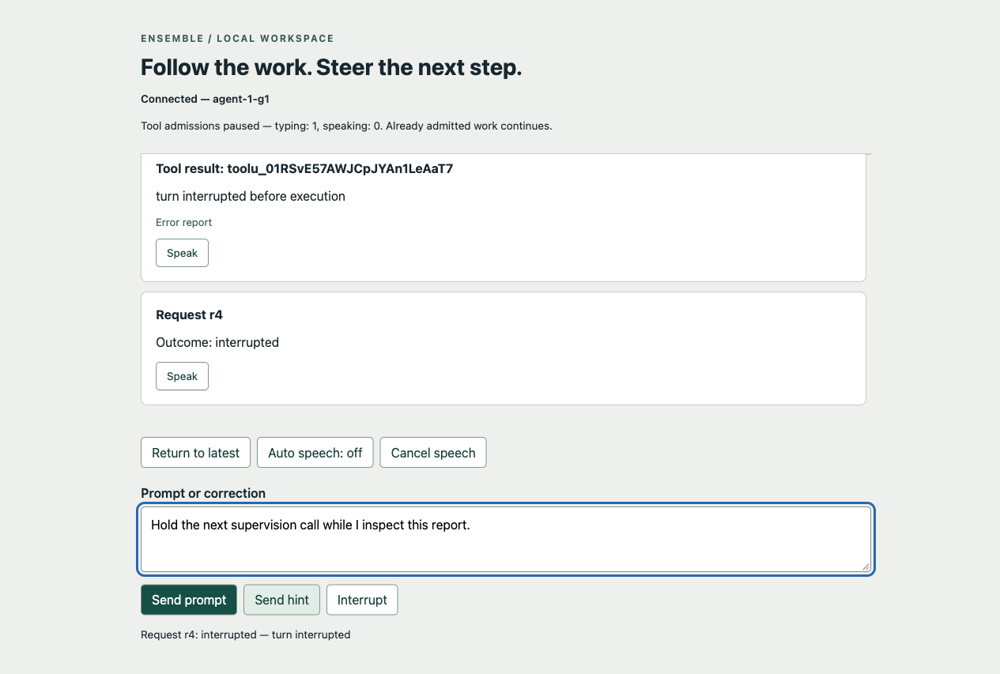
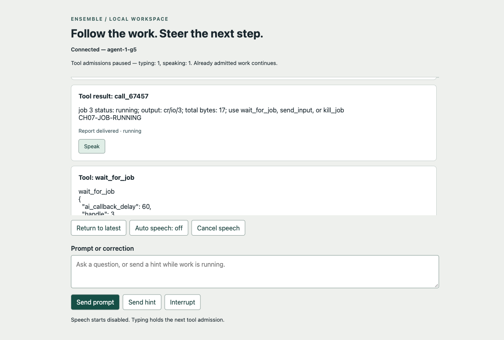

# Chapter 7: A browser you can steer from

Get ready for self-wielding.

Text-to-speech is not a convenience feature for Bill. It is how he reads.
His workflow with macular dystrophy includes listening to text at
750 words per minute. A terminal scrolling raw JSON is a wall of noise at
that speed. A browser that can speak the answer, distinguish tool calls
from the answer, and let him pause while he thinks is the difference
between using the agent and fighting it.

This is the ignition chapter, where the agent becomes something worth
living inside. Not because the screen is pretty, but because a human can
finally watch the work, hear the answers, and type a correction without
losing the thread. The grader can check the controls; it cannot decide
whether the screen suits its user. This is an AI coding agent for you,
so you will have to drive.

Chapter 6 gave streaming. The terminal shows tokens as they arrive, and
that is the safety floor: a human can watch. This chapter gives that human
a single scroll of readable cards, speech and controls that still work
while the agent is busy. Chapter 8 adds separate chat and action panes,
draggable dividers and saved preferences. First the screen has to make a
correction easier to deliver than to miss.

**Validation in progress:** the initial student implementation is preserved.
The [validation record](chapter-07-validation.md) tracks local checks, required
live demonstrations and the remaining independent review. The spin below records
the initial actual runs; their source identity remains separate from subsequent
repairs and final acceptance.

## TL;DR

Extend `solutions/edition-2/main/`. Read this chapter, the architecture ledger
and the entire `book/edition-2/skills/ensemble-coding/SKILL.md` before editing.
Keep the core module headless and the existing `gui/` module optional. The
validated `ch07/` directory will be a frozen export, never a working copy.

1. Implement the optional module's browser transport and reusable Server,
   Connector and ArtifactScroll surfaces. GUI children follow their actual
   parent chain to logging; they use public core interfaces. Core common holds
   transport-independent watch/pause values and interfaces. No WebSocket,
   speech, browser or rendering dependency enters the agent library.
2. Add Agent-owned pause registrations, changed in actor order through the
   public API. Each registration owns independent typing and speaking causes.
   Any true cause holds new tool admissions after its acknowledgement. The
   actor keeps processing controls; existing work continues. Disconnect releases
   that client's causes, and reconnect establishes fresh ownership.
3. Add public atomic watch: an owned recent durable-event snapshot, current
   recoverable partials and state, plus an ordered live tail from the same
   actor boundary. Use full Agent/request/operation/part identities. Windowed
   history announces what it omitted. No client cursor or restart recovery.
4. Bound watch and connection queues. Overflow, write failure or upstream
   observation loss invalidates that connection; close and resubscribe instead
   of silently dropping a final. One owner serializes socket writes and one
   lifetime ends all connection workers. Agent execution cannot wait on a tab.
5. Serve a local browser page and `/ws`, using the wire contract below. Prompt
   receipt, control acknowledgement, provisional output and reliable completion
   remain different records. Reconnect resets display state and never resends a
   prompt whose acceptance is uncertain. Preserve human CLI and protocol modes.
6. Render reusable Artifact cards for user input, hints, thinking, answer text,
   calls and results. Keep partials provisional and final records authoritative.
   Treat external text as data, render a small safe Markdown subset, and provide
   keyboard-accessible full-text expansion. Unknown/opaque content is labeled,
   not interpreted or auto-fetched.
7. Provide opt-in browser speech and an on-demand speaker action. Speaking or
   queued speech and nonempty input derive that client's pause causes. Explicit
   submission, cancel, error and disconnect reconcile them. Replay is silent;
   finalization does not speak the same text again.
8. Exercise the real browser, CLI and a public embedding on all three APIs.
   Use controlled tests for reconnect races, saturation, two-client pause,
   malicious markup and speech errors. Preserve initial source, student review
   and runs before independent historical comparison.

Build the headless CLI from main with `go build ./cmd`. Build the GUI command
from `main/gui` with `go build ./cmd/ensemble-gui`. `make grade-dir CH=8
DIR=solutions/edition-2/main` selects the historical GUI grader; its old binary
and wire assumptions are diagnostic, not acceptance of this new contract.
Run the full independent gate from the repository root against an immutable
source commit:

```sh
python3 scripts/edition2/accept_ch07_gate.py SOURCE_COMMIT
```

The initial source passed 32 of 33 groups; the remaining inherited structural
heuristic mistook immutable error and embedded-asset declarations for mutable
session globals. A corrected retained check closed that group without changing
the runtime. The narrower `python3 scripts/edition2/accept_ch07.py GUI_BINARY`
now has 23 wire checks; its original 15-check result remains dated evidence.
The full gate covers public, concurrency and browser behavior as well. All of
§7.9 remains required, including distinguishing controls for later corrections.
The browser-ownership correction supplement is
`python3 scripts/edition2/ch07-review-revisions.py SOURCE_COMMIT`; run it alongside
the full gate to check those later findings against the chosen source.
WebSocket library, internal method names and visual styling remain student choices.

## 7.1 Another receiver, with controls

The first edition compared an agent to a radio station. Adding a receiver
does not create a second broadcast. That picture holds, provided the
recording has a name: the durable event history. The live observation queue
is only a delivery path, and a full queue can lose its subscriber without
the station noticing.

A browser can submit a prompt, hint or interrupt through Ensemble. The same
Agent accepts it and the same actor writes the resulting history. Do not build
a browser-only prompt loop, give the GUI direct access to Engine, or make
WebSocket availability a condition of creating an Agent. The page will have
its own display state. It must not acquire a second conversation authority.

Retain the public GUI client parent established by the stub. Server reaches
Ensemble through that public owner interface; a connection reaches Server;
transport helpers keep their owning connection or server context. Server owns
connections, their subscriptions and their transport trace writer. Agent owns
pause registrations and the current watch projection. Engine still owns model
operations, and Jobs still owns processes and report cursors. The GUI cannot
borrow either owner merely because it displays their work.

Keep reusable Go server/connector surfaces public in the optional module.
Browser Connector and ArtifactScroll must also be importable components whose
owner provides their state and control path. A small embedding example replaces
the page layout while reusing those components; it does not copy the application
or reach into core internals. Shared GUI-only vocabulary may have its own common
package inside its module. It does not belong in core common just because two
browser components use it.

For multiple Pages in one document, an explicit browser application root owns
the shared native speech service. Pages are children of that root; each keeps
its own input, logical speech queue and pause registration and reaches the
service through its actual parent. The root is an ordinary owned object, not
a mutable module-global registry. Public constructor and method names remain
student choices. The parent chain makes ownership of the browser's shared
speech resource explicit.

The demonstration command creates one Ensemble and one Agent. It serves the
page and optionally attaches the existing human CLI to that same Agent with
`--terminal`. Extract a reusable public CLI client if needed; do not maintain
a second copy of its parsing and control rules. In this combined application,
terminal EOF drains its admitted prompts and detaches that client while the
server continues. `/quit` or process shutdown closes the application and joins
its owned clients and Agent. A browser disconnect alone has neither meaning.

## 7.2 Pause has an owner

A Boolean shared by two tabs cannot say whose pause it represents. The
failure is specific and easy to build: Tab A is still typing when Tab B
finishes speaking and sends false. The agent starts working. Tab A's
unfinished correction lands as a review comment instead of a hint. One
shared Boolean, two users, wrong answer.

Each attached client receives one public pause registration for one Agent.
Only that registration can update its `typing` and `speaking` Booleans or close
it. Both begin false. Agent's actor owns the authoritative cause map and applies
updates through its mailbox. The effective paused value is the OR of all live
registrations' causes. An empty map is unpaused. Closing a registration is
idempotent, removes only its own causes and refuses subsequent updates.

A pause update receives an acknowledgement after the actor has applied it.
If that acknowledgement says paused, no later tool admission can pass until
the causes clear. Admission means the actor's decision immediately before
persisting `tool_called` and beginning that call's normal lifecycle. A tool
already admitted can run or return after the acknowledgement. The GUI reports
that limit instead of promising to suspend a process halfway through a write.

The actor does not wait on a condition variable when paused. It keeps the next
call pending and continues servicing hints, status, job facts, interruption and
close. Clearing the final cause makes that pending admission eligible again.
The existing serial call order remains. A running-job report can finish while
the process continues, so serial reports never implied that only one process
could be alive.

Apply the gate to every model-issued tool call, including supervision calls.
Public interruption and close are controls, not tools, and remain available.
Interrupting while a batch is waiting follows Chapter 5's refusal/pairing and
completion rules; it cannot leave accepted calls silently unanswered. Pausing
alone does not cancel HTTP, stop streaming, consume a prepared report cursor,
or change the turn's outcome. It can hold calls after a response is accepted.

These are transient scheduling causes, not new conversation entries or replay
instructions. Expose effective pause state and causes in watch state without
changing Chapter 5's lifecycle enum. After applying an update or registration
close, the actor publishes `pause_changed` whenever the aggregate Boolean or
either cause count changes. Its public payload is `kind`, `agent_id`, `paused`,
`typing_clients` and `speaking_clients`. Counts are nonnegative integers; a
registration with both causes true contributes to both counts. A count change
still publishes when `paused` remains true. An identical repeated update or
already-closed registration produces no new pause observation.

The actor assigns this observation the next watch revision and publishes it
before returning the update acknowledgement. The acknowledgement includes that
applied `revision`; a no-change acknowledgement uses the latest watch revision.
This defines state order without requiring two different sockets to receive a
frame at the same instant. Every intact watch, including surviving clients
when another disconnects, sees the change. Default CLI protocol output remains
unchanged, and Chapter 6's opt-in CLI observation mode keeps its existing
filter. The new public observation is required on the GUI watch, not injected
into those established CLI records. Replay does not restore a disconnected
tab's pause. The public registration works without any browser, which makes
this behavior testable by an ordinary external consumer.

The historical injected shared gate bypassed the mailbox. In this actor it
would create a second decision owner and could block the very loop needed to
hear an interrupt. The new owned, acknowledged boundary is the coordinator's
working choice under the current architecture rules. It is not a claim that
Bill issued another ruling about every possible pause implementation.

## 7.3 Subscribe without missing the handoff

This is the problem that looks simple and is not. Reading history first
and subscribing afterward leaves a hole: an answer finishes between the
two operations. Subscribing first and then displaying the current history
can produce the opposite error: the same answer appears twice. Neither
failure requires an unreliable network. Both happen on localhost.

Add a public Agent watch operation that the actor processes at one ordered
boundary. It returns an owned snapshot and a live subscription. The snapshot
contains:

- Agent identity, a watch generation identifier and a revision watermark.
- The last 100 renderable durable events in sequence order, their first and
  last sequences, the total omitted renderable count, and the durable log's
  last sequence at this boundary. An empty window has null first/last values.
- Current lifecycle state, active request identity when any, queued request
  identities, effective pause and the counts of typing/speaking registrations.
  `active_operation` is null before `model_begin` or after `model_end`; between
  them it contains `agent_id`, `request_id`, `operation_id` and `delivery`, even
  when no fragment has arrived.
- Every recoverable in-flight part already published by the actor, with full
  Agent/request/operation/part identity and accumulated text for each channel.

Renderable durable kinds here are `message_received`, `hint_received`,
`response_ended`, `tool_called`, `tool_returned`, `job_ended`, `job_killed`,
`turn_started`, `turn_ended` and `error_occurred`. Both inherited terminal job
kinds belong in the window, so reconnect preserves the outcome of a killed
job as well as one that ended normally. The window is a presentation policy, not a
change to the log. Count events before projecting them to cards; one response
may supply several cards. If a tool result's call is outside the window, show
its call ID and result as an earlier-call card with an explicit missing-context
label. Do not guess a name or silently hide the result. State and usage come
from the current owners; do not recompute lifetime usage from that window.

The actor captures the snapshot and registers the tail at the same boundary.
Each later public observation has a strictly increasing Agent-local revision,
independent of durable sequence. This revision orders live state and partials;
it is not persisted and is never submitted by the browser as a reconnect cursor.
The watermark includes pause observations as well as model, durable-event and
other public state observations. A pause update before the cut appears in the
snapshot aggregate; one after the cut appears in the tail. The tail starts
strictly after that watermark. When the reader reconnects after `model_begin`,
the page uses the snapshot's active-operation metadata; it receives no
fabricated second begin.
It accepts subsequent full-identity deltas/finals/end for that operation even
if the initial partial list was empty. A mutation of returned
snapshot buffers cannot change history, another client or the next snapshot.

Agent owns the recoverable presentation projection. It is derived from actor-
published fragments, not a copy of unread parser buffers. Retain only the active
operation's provisional parts, bounded by Chapter 6's 16 MiB assembled-content
limit, and discard them at accepted/rejected end. Accepted responses are then
recoverable from the durable window. Rejected partials may stay on an already
connected screen marked incomplete; reconnect does not promise to recover them.
The watch never takes over Engine's assembly or accepts a response.

Carry Chapter 6's incremental assembly lesson into this projection. Append new
channel text to owned storage and maintain its byte count as it changes; do not
copy or serialize the whole growing answer for each delta. Materialize the
owned snapshot at the watch boundary. The live tail continues to carry changes,
so keeping reconnect possible does not make ordinary streaming progressively
more expensive.

Copy selected immutable values under their owning synchronization; do not hand
the server an append-only slice and assume that makes concurrent access safe.
Snapshot configuration is an explicit safe projection: identities, model name,
state and usage, never API keys, request headers, endpoint credentials or an
entire Config object. Snapshot creation performs no HTTP and waits on no socket.

The public subscription buffers at most 256 observations and 128 MiB of encoded
payload, whichever fills first. A single item over the byte limit also closes
it with overflow. This is a recoverable display limitation, not an Agent fault.
Its worker/lifetime rules remain Chapter 5's. The GUI copies the snapshot into
its connection's initial delivery, then drains that tail. If the tail overflows
while the snapshot is being sent, abandon that generation and close; do not
present it as a complete catch-up.

## 7.4 A small wire with an explicit reset

Serve static assets from the optional module's `web/gui/`, with an embedded
copy acceptable. The demo binds `127.0.0.1`, defaults to port 8088 and accepts
`--port 0` for an OS-assigned port. Print the actual local URL after listening.
Use the inherited environment variables for model configuration and credentials;
flags configure this server's port, terminal attachment and optional trace.
Never accept a model credential from a WebSocket message or put it in the page.

Require the HTTP Host and WebSocket Origin to match the actual local server
origin, including port. Reject absent, null or foreign Origin before upgrading.
The nonbrowser test client sends that same expected Origin explicitly. This
local demonstration does not authenticate other local processes and is not a
remote deployment recipe. Browsers permit cross-origin WebSocket attempts;
the server must make the decision. The [WebSocket server guide](https://developer.mozilla.org/en-US/docs/Web/API/WebSockets_API/Writing_WebSocket_servers)
explains that boundary and the limits of Origin outside browsers.

Use one UTF-8 JSON object per WebSocket text message, at most 65,536 bytes for
an incoming command. Binary frames, invalid UTF-8, malformed JSON, an oversized
message or a non-object value close the connection with an explanatory static
reason, without contacting the model. A missing, empty or non-string command
`id` also closes: the server cannot return the required correlation safely.

A JSON object with a usable nonempty string `id` can contain a correctable
command error. An unknown command or field, a missing required command field,
or an invalid field value gets a correlated `invalid_command` error and leaves
the connection usable. The same is true of a well-formed command refused by
the Agent, using its appropriate error code. None of these refusals contacts
the model. This distinction lets a client correct a command without treating
a broken transport message as an admitted request.

Each command has a nonempty client-generated `id`, unique on that connection.
The server remembers accepted command IDs until disconnect and refuses reuse;
cap the connection at 4096 commands, closing it before accepting the next one.
IDs correlate replies; they are not retry tokens across reconnects. Commands
before subscription are refused except `subscribe`. One subscription per
connection is sufficient for this chapter; another subscribe is refused.

```json
{"type":"subscribe","id":"c1"}
{"type":"prompt","id":"c2","text":"Read notes.txt and summarize it."}
{"type":"hint","id":"c3","text":"Use the corrected directory."}
{"type":"pause","id":"c4","typing":true,"speaking":false}
{"type":"interrupt","id":"c5"}
```

`prompt` queues an ordinary human request. `hint` uses the active request's
existing hint path and reports receipt separately from delivery. `interrupt`
returns the existing accepted/no-op acknowledgement. `pause` requires both
Booleans and replaces only this connection's causes. Blank prompt/hint text
is refused. The one-Agent demo chooses its Agent at construction; a client
cannot select an arbitrary ID in a command.

The server's initial response is `snapshot_begin`, followed by ordered
`snapshot_event` records and zero or more `snapshot_partial` records, then
`snapshot_end`. Every record names the same `generation`; begin includes the
subscribe command `id`, Agent identity, watermark, range, omission count and
safe current state. An event record carries its durable sequence and projected
event. A partial carries its full identity and complete accumulated channel
strings. End repeats the generation and watermark. The Connector stages the
new generation and replaces the displayed history only when end arrives.
A broken snapshot cannot merge half of itself into a previous display.

Use these field names. This empty-history example has no active request,
queued requests, usage or pause causes; null range values differ from sequence 0:

```json
{"type":"snapshot_begin","id":"c1","generation":"g1","agent_id":"a1","watermark":0,"first_seq":null,"last_seq":null,"log_seq":0,"omitted":0,"state":{"lifecycle":"idle","active_request_id":null,"active_operation":null,"queued_request_ids":[],"paused":false,"typing_clients":0,"speaking_clients":0,"model":"fixture-model","usage":[]}}
{"type":"snapshot_end","generation":"g1","watermark":0}
```

`usage` is the existing per-provenance accounting array, with its original
producing identities and disjoint counters. A `snapshot_event` has `generation`
and `event`, the existing neutral durable event after the browser-safe projection
below; its sequence remains inside `event.seq`. A `snapshot_partial` has
`generation`, `agent_id`, `request_id`, `operation_id`, positive `part_id`, and
`channels`, an object containing only present `text`, `thinking`, `tool_name`
and `tool_args` strings. Empty strings may be present. The snapshot does not
invent an accepted final for those strings. The opaque placeholder on either
a snapshot or final wire part is exactly `{"type":"opaque","placeholder":true}`;
its surrounding record retains identity and position, while its raw bytes and
provenance-only signature fields remain server-side. Known text and calls lose
only their opaque/signature metadata in this display projection.

After end, deliver ordered live `observation` envelopes and correlated replies:

```json
{"type":"accepted","id":"c2","request_id":"r1"}
{"type":"ack","id":"c3","request_id":"r1","seq":7,"sent":false}
{"type":"ack","id":"c4","revision":43,"paused":true,"typing_clients":1,"speaking_clients":0}
{"type":"ack","id":"c5","accepted":true,"request_id":"r1"}
{"type":"observation","generation":"g1","revision":42,"observation":{"kind":"model_begin","agent_id":"a1","request_id":"r1","operation_id":"m1","delivery":"stream"}}
{"type":"completion","request_id":"r1","outcome":"interrupted","text":"","pending_hints":0}
{"type":"error","id":"c6","code":"invalid_command","message":"unknown command field"}
```

For example, a second typing tab increments the count without changing the
Boolean. Closing the first tab then decrements it; the surviving tab observes
both applied states through its own generation:

```json
{"type":"observation","generation":"g1","revision":44,"observation":{"kind":"pause_changed","agent_id":"a1","paused":true,"typing_clients":2,"speaking_clients":0}}
{"type":"observation","generation":"g1","revision":45,"observation":{"kind":"pause_changed","agent_id":"a1","paused":true,"typing_clients":1,"speaking_clients":0}}
```

These revisions illustrate consecutive changes in a controlled fixture; other
observations may occupy intervening revisions in a real session.

The acknowledgement forms inherit Chapter 5's semantics; an idle interrupt
uses `accepted:false` without inventing a request. A pause acknowledgement
reports the applied aggregate even when another client keeps it true. Include
request IDs in all per-request events. The submitting connection gets one
reliable completion per accepted prompt while connected; other viewers learn
its outcome from durable turn observations. Reading more commands must not
wait for a prompt's completion. Preserve begin/final/end-before-completion
ordering while the watch is intact, as Chapter 6 already requires for its CLI.

The browser never parses model SSE. Project ordinary text, calls, results and
explicitly exposed thinking for display; do not serialize opaque raw payloads
or signatures onto the browser wire. An opaque final has an identity and a
placeholder classification. The server's projection must preserve ordered
positions and the distinction between absent visible content and an empty
text part. No static “assistant answered” string substitutes for the actual
accepted response.

Apply the display projection recursively to every typed part list: accepted
response parts, message parts, `tool_returned.tool.parts`, and nested
`tool_result.parts` in public neutral result values. At every position, replace
a standalone opaque part with the exact placeholder above; remove bound
`opaque` and signature metadata from recognized text and calls; recurse through
result children without changing order, call IDs, error flags, references or
present empty text. Apply the same rule to live finals and snapshot events.
This is a typed projection, not a recursive deletion of every JSON key spelled
`opaque` or `thoughtSignature`: a tool argument object or literal text can
legitimately contain those names and remains user data.

Use these payload excerpts inside otherwise valid fixtures. An accepted
response contains these two parts in order:

```json
[{"type":"text","text":"","from":{"vendor":"gemini","model":"fixture-gemini","surface":"generate_content"},"opaque":"text-signature"},{"type":"opaque","from":{"vendor":"gemini","model":"fixture-gemini","surface":"generate_content"},"data":{"nested":{"thoughtSignature":"hidden-bytes"}}}]
```

The displayed parts are exactly:

```json
[{"type":"text","text":"","from":{"vendor":"gemini","model":"fixture-gemini","surface":"generate_content"}},{"type":"opaque","placeholder":true}]
```

The empty text retains its position; the whole opaque payload is gone. For
recursion, use this `tool_returned.tool` payload after its valid matching call:

```json
{"call_id":"read-a","parts":[{"type":"text","text":"","from":{"vendor":"gemini","model":"fixture-gemini","surface":"generate_content"},"opaque":"result-signature"}],"is_error":false}
```

Its displayed `parts` retains the empty text and safe provenance but removes
`opaque`; `call_id` and explicit false remain unchanged. Chapter 2 permits only
text/blob/redacted result children. Do not add an invalid opaque result child
merely to test recursion. The standalone opaque response part tests nested raw
payload removal; the valid result child tests recursive bound-signature removal.
A tool call with args `{"opaque":"keep-as-argument"}` must retain that argument
unchanged. These fictional signatures test projection, not provider acceptance.

If the reader submits a prompt and the socket fails before `accepted`, show
acceptance unknown and reconnect to inspect history. Do not resend automatically. This
chapter provides catch-up, not distributed exactly-once request submission.
A new connection gets a new registration and snapshot generation, resends its
current typing/speaking causes, and discards frames from earlier generations.
Disconnect cancels local speech and releases that old registration. It does
not cancel an already accepted Agent request.

## 7.5 A slow tab must not own the actor

The first edition had a crash at this boundary: closing a tab could close a
channel that a broadcaster was about to use.

Give each connection a bounded outgoing queue with the same 256-message and
128 MiB limits as the watch. Snapshot records pass through that queue too;
a producer may wait only outside the actor, cancellably, during snapshot
sending. Live delivery never silently drops a frame. If it cannot enqueue,
mark the generation incomplete and close the connection with a resync reason.
The next connection takes a fresh snapshot. Another client and the reliable
request handles continue independently.

One writer owns data-frame writes and their deadlines. The reader remains free
to receive controls while model work runs. Use a finite write timeout, at most
five seconds, and a ping/pong or equivalent liveness mechanism that detects a
dead connection within 30 seconds. The selected library's concurrency rules
still apply; for example, [Gorilla permits one concurrent reader and writer](https://pkg.go.dev/github.com/gorilla/websocket).
A library choice is not permission to call its writer from every observer.

Connection close removes it from future delivery, closes its pause registration
and watch, cancels workers, closes the socket and joins owned readers/writers.
Do not hold the recipient-set lock across network I/O. Producers must never
send into a channel teardown can close underneath them. A separate done signal
with one documented queue owner is a straightforward choice.

This was a real historical failure. A broadcaster copied its client list,
released the lock, and started sending. Teardown removed a copied client and
closed its send channel. The broadcaster then sent to that closed channel.
The `default` in its nonblocking select protected against a full buffer and
provided no protection against the actual crash. The recorded repair is
[`352b590`](chapter-07-evidence.md). A deterministic test should hold the sender
after selecting the recipient, close the connection, then release that sender.
A thousand lucky disconnects would not establish the same property.

Optional `--gui-log PATH` writes JSON lines with UTC `time`, connection ID,
`direction`, `stage` and the application `message`. Directions are
`client_to_server`, `server_to_client` and `local`. Stages distinguish inbound
`received`, outbound `queued`, outbound `written` and local `closed`/`failed`
records with safe reason. Never call a write “rendered” or “heard.” The trace
contains conversation content and is disabled by default; it never records
headers or configuration secrets. The GUI server owns this writer and reaches
ordinary diagnostics through its Ensemble parent. Trace write failure reports
an error and disables further tracing; it does not silently claim a complete
trace or stop the Agent.

## 7.6 One Artifact, several honest states

Every piece of the conversation deserves an identity and a lifecycle. A user
prompt, an answer, a tool call and a result differ in how they look on screen,
not in whether they need to be tracked. ArtifactScroll is the component that
manages these ordered cards. Keep the component independent of WebSocket: it
accepts projected records through its owner's interface. Connector owns socket
and generation state; the page controller owns Connector, ArtifactScroll,
input state and speech queue.

A provisional part's key contains Agent, request, operation and local part ID.
At acceptance, map it to Agent plus response sequence and part position using
Chapter 6's final. Replace or finalize the existing card; do not append the
answer twice. A tool call's durable call ID links its accepted proposal,
`tool_called`, result and later job observations. Treat `tool_returned` as the
report delivered to the conversation. A report saying running is not a completed
process. The later `job_ended` or `job_killed` supplies the terminal lifecycle
fact: ordinary completion or a deliberate/shutdown kill under Chapter 4's
existing rules. Interrupting a turn does not itself kill its running jobs.

On snapshot, build finalized cards from the selected durable events and then
recover the current partials. A known call can have a result outside the window,
or vice versa; show the missing context explicitly. Reconnecting twice must not
duplicate cards, speak history, or manufacture a tool start. Keep abandoned
provisional content visibly incomplete on the old display until a complete
new snapshot replaces it.

Render tool names, arguments, results and unknown material using text nodes.
For answer/thinking Markdown, support at least paragraphs, emphasis, lists and
fenced code through a safe renderer that disables raw HTML. Links, if supported,
allow only explicit HTTP/HTTPS destinations and never execute JavaScript URLs;
do not auto-load images, frames, media or referenced files. ANSI output may be
shown with recognized color codes removed or safely styled; other control
sequences cannot modify the page. A filename containing markup remains a
filename. Browser HTML injection and model prompt injection are different
boundaries, even when the same hostile file supplies both inputs.

Long cards initially show a bounded preview and its omitted character count.
A keyboard-operable expander exposes the entire retained card text; a tooltip
alone is insufficient. Keep the full value and its safe rendering available
without asking the model again. A reference to bytes omitted by a tool is
still only a reference: distinguish the full retained report from the job's
larger artifact. Do not invent a browser file-fetch endpoint in this chapter.
The page can tell the reader to ask the Agent to retrieve the artifact.

Use labeled controls, a visible connection/generation status, readable request
outcomes, and programmatically exposed expanded/pressed states. Keep focus in
the input when cards arrive. Following the latest output is useful, but a user
who scrolled up to inspect a result must not be pulled back on every token.
Provide an explicit return-to-latest action. These behaviors need browser tests;
a passing Go transport check cannot inspect them.

Page, ArtifactScroll and Artifact each remove the DOM listeners they installed
when closed. Close is idempotent, and the owning connection/controller cancels
pending reconnect callbacks. A replacement Page can mount on the same DOM root
without the old instance clearing its input, submitting commands or moving
focus. Removing the old cards alone does not release handlers on a retained
input or button; test the replacement through those actual controls.

## 7.7 Speech is a queue with cancellation

For Bill, this is the whole chapter. Auto-speech begins disabled, and a
labeled user action enables it. When it works, the agent speaks its answers
while the human's hands stay on the keyboard. When it breaks, half a sentence
repeats, a finalized answer restarts from the top, or a canceled utterance
fires its callback and accidentally resumes the queue.

Unavailable or failed browser synthesis is reported without disabling text or
controls. Auto-speech reads new visible answer text and explicitly exposed
thinking, plus a concise tool name/path summary. Tool results and replay are
silent. The speaker action on each card reads its full accessible text on
demand. Neither path reads signatures or opaque provider payloads.

Own one logical queue per page controller. Buffer stream text into sentence-sized
pieces, flush any remaining text at accepted end, and track the already queued
text for each full part identity. Finalization must not queue those words again.
Interrupted partial speech is canceled along with its provisional operation;
other on-demand speech has its own queue identity. Register speaking=true when
an utterance is queued, before starting it, and keep that cause true until the
queue is empty. A brief gap between utterances is still occupied speech work.

The native speech API is shared within a document. An idle Page calling its
global cancel operation can stop a different Page's utterance, even when their
logical queues are separate. The browser application root's service accepts
owned requests in FIFO order and submits one native utterance at a time. Each
request retains its Page identity. A Page waiting for native output still has
speaking work and keeps its speaking cause true. The service reaches logging
through its root; Pages reach it through their parent, without sibling injection.

Cancel or close removes only that Page's pending requests. Invoke native cancel
only if that Page owns the active utterance, then let other Pages continue.
Closing or disconnecting an idle Page cannot stop another Page's speech. Both
service and Page fence stale callbacks so a canceled completion cannot settle
a replacement utterance, restart old work or clear another Page's pause cause.
On application-root close, stop native speech admission before disposing Pages,
so canceling one Page cannot start another Page's queued utterance during shutdown.

Maintain one local predicate from input text and queued/current speech. Send
both Boolean causes on each transition; do not send unpause merely because
one utterance ended while the input still contains text. Apply the same state
reconciliation after typing, clearing, prompt/hint submission, speech completion,
error, explicit cancel and connection change. Submission explicitly clears
and reconciles input; assigning an empty value does not fire an input event.
The historical GUI once waited forever for that nonexistent event.

A cancel action clears the owned queue, advances its generation, asks the
shared service to cancel that Page's requests and reconciles its pause causes
immediately. Later
callbacks from canceled utterances cannot advance an old queue or restart
speech. Normal completion and non-cancellation error settle their utterance
once and advance the current queue. Browser [cancel behavior](https://developer.mozilla.org/en-US/docs/Web/API/SpeechSynthesis/cancel)
and [error reasons](https://developer.mozilla.org/en-US/docs/Web/API/SpeechSynthesisErrorEvent/error)
were checked on October 7, 2026; they do not establish that a human heard an
utterance. Keep that claim out of transport receipts.

Escape with empty input cancels speech and re-evaluates pause. Escape with text
must not silently submit or erase a correction. Interrupt is an explicit
button and the inherited CLI control. On disconnect, cancel speech and show
that this page no longer holds a pause. A backgrounded tab or missing voice
must not silently hold a lost registration forever; connection lifetime rules
still apply. Any browser-specific speech workaround requires an observed,
versioned failure and its own test, not a copied universal claim.

## 7.8 Taking it for a spin

The student drove the human terminal and Chrome on October 7, 2026 Pacific
time, using the initial runtime `da162e8` and launch binding `ba902b7`. These
are student-driven sessions, preserved before historical code comparison.
The browser was Chrome 154.0.8037.93 on macOS 26.3.1(a).

After setting the inherited model and credential environment, build from
`solutions/edition-2/main/gui`, then launch in a scratch workspace. Python 3
must be available for the delayed-job example:

```sh
go build -o /tmp/ensemble-gui ./cmd/ensemble-gui
mkdir -p /tmp/ensemble-browser-spin
cd /tmp/ensemble-browser-spin
/tmp/ensemble-gui --port 0 --terminal
```

Open the printed local URL in two tabs. In the terminal, ask for a brief
greeting, inspect `/history`, then continue the conversation. Scope any
no-tools instruction to “this answer only.” Both tabs should show the same
accepted history. Reload one during an answer and again after completion.
The recorded runs captured active operations on all three API paths; only
the Messages timing happened to capture nonempty partial text. A controlled
held-open response supplies the stronger partial/final boundary check.

In the browser, ask the Agent to write `browser-note.txt` containing exactly
`BROWSER-CH07` followed by a newline, then read it with the file tool. The
Chat Completions run initially produced an intention instead:

```text
I will write the file browser-note.txt with the content "BROWSER-CH07\n"
as requested, then read it back with the file tool.
```

That is an abridged answer, not a tool receipt. The next human prompt explicitly
ended the earlier no-tools restriction and demanded the missing calls. The
model then proposed `write_file` and `read_file`, and they executed. The earlier
restriction may explain its first response; the transcript cannot establish
that cause. All three runs eventually left the same 13-byte file. Inspect the
file and call/result cards before accepting a model's summary of its own work.

Next ask for this bounded command through `run_command`, with
`ai_callback_delay=1`, followed by `wait_for_job` with a 60-second callback
delay. Instruct the model to keep waiting until corrected or interrupted:

```sh
python3 -u -c 'import time; print("CH07-JOB-RUNNING", flush=True); time.sleep(180); print("CH07-JOB-DONE", flush=True)'
```

The returned handle was 3 in each fresh demonstration workspace; use the
handle actually returned in yours. Start typing a correction in one tab and
observe its acknowledged pause before the next supervision admission. Clear
or finish speech in the other tab: the first tab's typing must still hold.
Send a hint asking the next report to begin `CORRECTION-DELIVERED`, then keep
waiting. Its text reached the next model request on all three APIs. Messages
and generateContent printed the marker; Chat Completions kept waiting without
printing it. Delivery and obedience have different receipts.

Type another correction without submitting it, then issue `/interrupt` in
the terminal. The pending supervision call is refused and the turn settles.
The Messages run retained this screen:



Clear that input before the cleanup prompt. Ask the Agent to poll the handle
with zero callback delay and deliberately kill it. The observed sequence,
abridged from the Messages run's tool records and terminal, was:

```text
/interrupt
Interrupt: request=r4 interrupted=true.
[Next prompt: poll handle 3, then deliberately kill it.]
wait_for_job {"handle":3,"ai_callback_delay":0}
[Report: running, 17 bytes, CH07-JOB-RUNNING]
kill_job {"handle":3}
[Final status: killed]
```

Interruption stopped the turn; cleanup stopped the process. The running report
and later terminal job fact establish that distinction even when a model's
explanation loosely calls every result a completed operation. The generateContent
screen below shows the earlier running report while separate typing and speaking
causes both hold new tool admissions:



After cleanup, close a tab while it owns a typing cause and watch the surviving
tab's count fall. Send terminal EOF, then submit another browser prompt. Every
recorded browser still answered `BROWSER-STILL-LIVE`: terminal detachment had
left the shared Agent and server usable. Use `/quit` or application shutdown
when the entire session should end.

Enable auto-speech through its button, try a card's speaker action, and cancel
while the other tab still contains text. In these runs, real synthesis started
and cancel released speech while preserving typing. Audio captured from each
exact Chrome process had a silent first PCM second and a later audible signal.
The first generateContent selection spoke a user card; a second deliberate
selection captured the model answer. Both attempts remain in the evidence.
These recordings establish produced audio, without claiming transcription or
human listening. Wall-clock capture startup was asynchronous;
a requested two-second lead did not guarantee two seconds of recorded silence.

The full initial matrix also exercised standalone plain human chat and a public
embedding that reused the components with a custom layout. In that embedding,
one Agent's typing pause stayed set while a second Agent answered; their
responses remained distinct. The counts below include those sessions and tool
continuations, rather than just the pictured browser:

| API and observed model | Admitted prompts | Model HTTP requests |
|---|---:|---:|
| Messages, `claude-sonnet-4-6` | 9 | 15 |
| Chat Completions, `gpt-4.1-mini-2025-04-14` | 10 | 14 |
| generateContent, `models/gemini-3.8-flash` | 9 | 15 |

All 44 original request bodies matched independent replay. The
[live results](../../solutions/edition-2/main/evidence/ch07/live-results.md)
link raw terminals, browser actions, screenshots, files, usage and audio
receipts; [the evidence ledger](chapter-07-evidence.md) distinguishes these
initial runs from revisions. Exact snapshot cuts, malicious content, saturation,
uncertain acceptance and stale speech callbacks use deterministic local checks.
Paid timing cannot force those failures reliably.

The initial use also exposed an omission in §7.3: killed jobs reached the live
page, but its printed reconnect list included only `job_ended`. The corrected
contract includes inherited `job_killed` too. The initial receipts remain bound
to the original runtime; the affected projection repair and its reconnect
checks are separate work tracked in the validation record.

## 7.9 Checks that can distinguish a working screen

| Contract | Required control and distinguishing failure |
|---|---|
| Ownership | Headless build without GUI module; external embedding reuses public components; actual parent paths and every executable inspected; same-root remount has no old DOM handlers or reconnect callbacks |
| Watch boundary | Barrier at snapshot capture and partial/final/tool transition; replay plus tail has no missing or duplicated accepted card |
| Identity | Two responses and two Agents reuse local part IDs; cards and speech cursors stay separate |
| Snapshot | Exactly 100 selected events, omitted prefix, earlier-call result, owned-copy mutation, no credential/config leak or HTTP |
| Slow client | Saturate a watch and socket queue separately; generation closes, another client and completion work, resubscribe recovers final state |
| Teardown | Pause sender after recipient selection, disconnect, resume sender; no panic, blocked worker or retained pause |
| Pause | Two clients with independent typing/speaking; clearing one cannot release another; acknowledgement excludes later admission; interrupt and close work while held |
| Tool lifecycle | Running report remains running, later job completion updates its card; pause does not cancel existing work or consume report cursors |
| Browser content | Markup in name/args/results, unsafe Markdown links, ANSI controls, long text expansion and keyboard actions remain data and accessible |
| Speech | Final text not repeated, replay silent, cancel then stale callback cannot restart, error releases only its own cause; two Pages share FIFO native output without cross-cancellation; real browser synthesis separately observed |
| Protocol | Correlated refusals, no prompt resend, partial snapshot abandoned, local Origin/Host/message limits, serialized writer and trace-stage accuracy |
| Retention | Prior CLI/protocol/replay checks and model usage remain correct; no GUI-dependent core behavior |

Seed the watch handoff with a held operation that has published `Hel`. Subscribe
while it is held, then release `lo.` and the accepted final. The new page must
show `Hello.` once, with one final card, whether the final lands just before or
just after the snapshot boundary. Repeat with a tool response and reuse local
part ID 1 on a second Agent. Inject a result with call ID `older-call` whose
call lies before the retained window; require its result and missing-context
label, not a fabricated tool name.

For content, supply the literal tool name `` and a
result containing `[open](javascript:alert(1))`, then exercise both preview and
expanded view. No script, navigation or image fetch may result. For speech,
queue A and B, cancel, queue C, then deliver A's stale error/end callbacks.
Only C may remain eligible to start; the client's typing cause must survive
throughout if its input still contains text.

Every negative needs a passing fixture and an intended failure. An XSS check
that never rendered its seeded payload, or a disconnect race whose sender never
ran, proves nothing about the advertised property. Preserve required legacy
coverage and add the new checks rather than calling the old score a browser
audit. Implementation, live receipts, comparative revisions and final
proofreading remain required after implementation of this accepted contract.

---

The terminal was a safety floor. The browser adds cards that distinguish
provisional text from accepted answers, speech that keeps the human's hands
free, and pause controls that know which tab owns them. Reconnect restores
the retained 100-event window and current partials, with an explicit count
of omitted older events. The next chapter makes the screen remember what
the human prefers.
