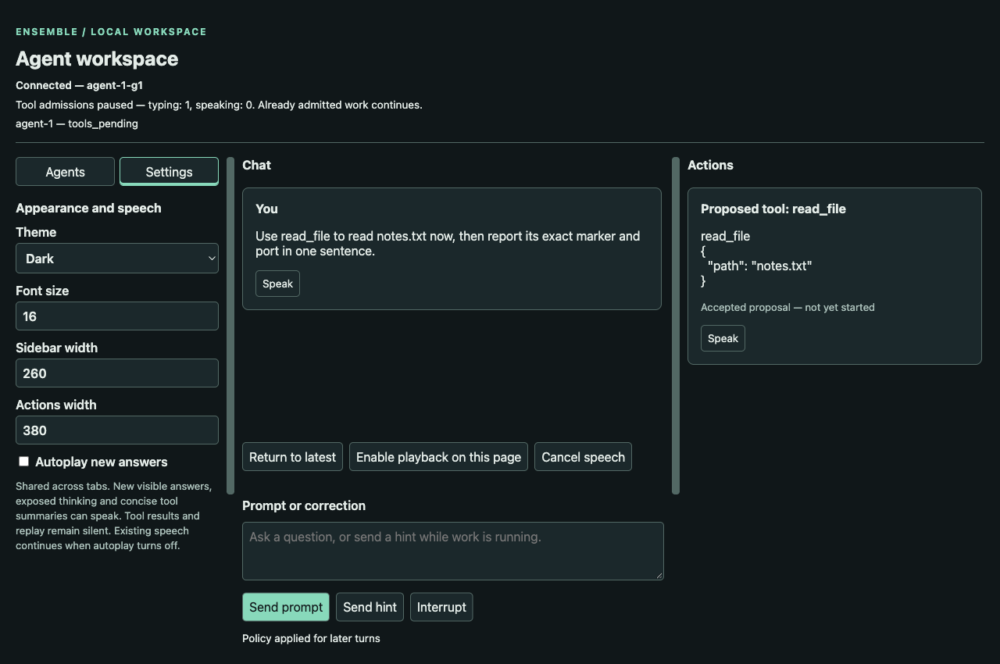
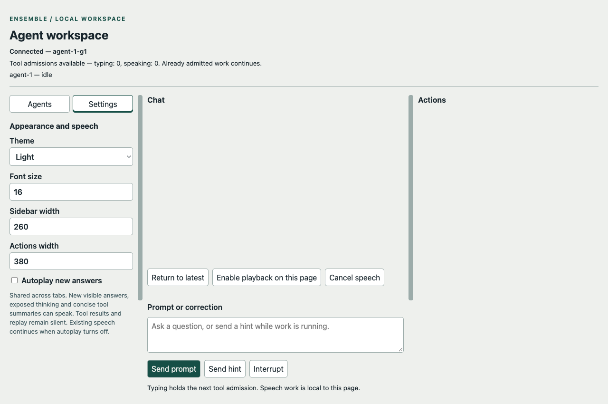

# Chapter 8: Preferences that do something

The server accepts a temperature of zero. The settings panel still displays -5.

The first edition's frozen Chapter 9 client reproduces that discrepancy:
`omitempty` removes zero from the state message, and the browser keeps the
rejected draft. The neighboring speech field behaves differently. That client
coerces an omitted speech flag to false, so it does turn speech off. A shared
encoding mistake does not prove an identical failure in every consumer. The
[historical control](checkpoint-evidence/ch08-review-historical-settings.json)
keeps both results, including the one that contradicts the stronger story.

Saving a preference, applying it, and displaying it are three different
jobs. A settings panel can get two of them right and still be wrong where
the reader notices.

This chapter makes the interface worth keeping open. Chat and actions get
separate panes; preferences survive a restart; every tab learns what changed.
An execution setting reaches the actor that actually enforces it. The screen
must show the applied value, and the running program must use that value at
the promised boundary.

The worked example below uses the student's actual October 8, 2026 runs,
including the failures that led to the speech and numeric corrections. The
[validation record](chapter-08-validation.md) tracks independent acceptance
and the final checkpoint; the example does not imply personal testing by Bill.

## TL;DR

Extend `solutions/edition-2/main/` after the coordinator releases the accepted
Chapter 7 baseline. Read this chapter, the architecture ledger and the entire
`book/edition-2/skills/ensemble-coding/SKILL.md` before editing. Do not consult
the first-edition answer or author research. A validated `ch08/` is a frozen
export, never a second development tree.

1. Reuse the optional GUI module's Connector and ArtifactScroll in a sidebar,
   chat pane and actions pane. Preserve all Chapter 7 safe rendering, identity,
   expansion, reconnect, pause, streaming and public embedding behavior.
   Expose controls through semantic HTML and keyboard interaction.
2. GUI Server owns a persistent display-preference service: theme, font size,
   pane widths, automatic speech enablement and speech rate. Each page still
   owns its input, current/queued speech, cancellation generation and pause
   registration. Core Agent code imports no GUI preferences or transport.
3. Agent owns a separate execution-policy service and its creation-only
   persistence path. This chapter exposes only the maximum model requests per
   human turn: zero selects the existing default of 16; positive 1–256 selects that
   limit. Actor-ordered updates affect turns activated after application;
   an active turn retains its captured policy through every continuation.
4. Define sparse patches separately from complete snapshots. Omission preserves
   a value; explicit false/zero writes it. Reject unknown fields, null, wrong
   types, duplicate keys and out-of-range values before any mutation. Validate
   persisted input with the same schema. Never serialize credentials or Config.
5. Persist a complete versioned candidate before applying and acknowledging it.
   Each owner has its own revision and update serialization. A stale revision,
   busy writer or failed write returns a safe correlated error. No transaction
   across GUI preferences and Agent policy is promised. Publish complete applied
   snapshots, including false and zero.
6. Add the wire commands and snapshot fields below. A reconnect receives a
   current snapshot followed by newer changes in each domain, without a missed
   handoff. Retain Chapter 7 connection bounds and default CLI protocol.
   A settings acknowledgement is never a prompt completion or a pause update.
7. Shared “Autoplay new answers” controls future automatic enqueue. Capture the
   locally applied preference revision and rate when each utterance is queued.
   Existing queues retain their entries and rates. Cancel speech is local to
   the page; a preference patch cannot clear another tab's pause causes.
8. Verify behavior as well as JSON: two-tab changes, false/zero, failure atomicity,
   restart, actual speech, keyboard resizing and active-turn policy isolation.
   Then use the real browser, human CLI and public consumers on all three APIs,
   preserving initial attempts before independent comparison and review.

Build the CLI from main with `go build -o /tmp/ensemble-ch08-cli ./cmd` and the GUI command from
`main/gui` with `go build ./cmd/ensemble-gui`. The historical diagnostic is
`make grade-dir CH=9 DIR=solutions/edition-2/main`; its old layout and wire
assumptions do not grade this new contract. Run the complete new gate with
`python3 scripts/edition2/accept_ch08_gate.py SOURCE_COMMIT`, using the immutable
commit containing the intended main tree. The focused
`python3 scripts/edition2/accept_ch08.py GUI_BINARY` remains useful for settings
wire and persistence diagnosis. It does not replace the full gate, browser
checks or actual use. Public method names, storage implementation and visual
styling remain student choices.

## 8.1 Give each setting an owner and a consumer

A font size has no reason to enter Engine. A model-request limit has no reason
to be read from a browser's settings store. The temptation is to put both in
one convenient JSON object, because that makes the first screen easy and the
second client impossible.

Server owns a display-preference service inside the optional GUI module. It
holds the applied preference value, its revision and its file identity. Shared
GUI declarations may live in that module's common package; implementation
belongs in the responsible GUI package. The service and its persistence helpers
retain owner access through Server and its public application parent to the
logger. No callback bundle supplies missing reachability.

Agent owns execution policy. Its shared values and owner interfaces belong in
core `internal/common`; policy persistence belongs in a responsible core spoke.
The actor reads and changes the Agent's authoritative policy through that
owner chain. A private service implementation may live in its spoke with an
Agent interface back-pointer. It cannot import llm or the GUI, and Engine does
not acquire a closure that secretly reads the GUI's copy.

The public policy interface works in a headless application. Server forwards a
policy request through that interface and presents the result. It cannot change
Agent fields itself. The existing general configuration path keeps its earlier
active-turn restrictions; the new policy-update operation is the one explicitly
specified live transition here. Model selection, credentials, workspace, log
identity and unrelated configuration do not become editable browser settings.

A page owns what is happening on that page: unfinished input, speech work,
selected tab, scroll position and the live pause registration. The persisted
preferences supply shared presentation defaults and future enqueue policy.
They do not become owners of those transient activities. This split is the
coordinator's working design under the existing architecture rules, not a new
claim that every application must share preferences in exactly this way.

## 8.2 A patch needs to say whether a field exists

This is where the zero-broadcast bug lived, and where it will come back if
the lesson is not structural.

The display-preference snapshot has exactly these fields:

| Field | Default | Accepted values |
|---|---|---|
| `theme` | `dark` | `dark`, `light`, `system` |
| `font_size` | 16 | integer 12–28 CSS pixels |
| `sidebar_width` | 260 | integer 180–480 CSS pixels |
| `actions_width` | 380 | integer 200–640 CSS pixels |
| `autoplay` | false | Boolean |
| `speech_rate` | 1 | finite number 0.5–2 |

The stored execution-policy value contains exactly
`max_model_requests`, an integer 0–256. Zero selects the named default of 16;
its stored value remains zero. The UI displays “Default (16)” for zero,
rather than implying the Agent may send no requests. The safe snapshot also
reports the effective value 16 or the positive configured value.

A patch contains any nonempty subset of its domain's fields. An omitted field
is unchanged. A present field is a proposed value even when it is false or
zero. Do not decode a patch into a zero-filled snapshot and then guess which
zero the sender meant. Presence can be represented with dedicated optional
fields or validated raw members; the choice is left to the student.

Reject duplicate JSON object keys, unknown fields, null values, strings used as
numbers, fractional integer fields and values outside the table. Boolean is
not a number. Reject the whole patch if one member is invalid. The same valid
ranges govern a complete file loaded at startup. This chapter uses rejection,
not silent clamping: the control keeps showing the applied value and displays
a useful reason for refusing the proposed one.

The earlier zero-broadcast defect still matters under rejection. Turning
`autoplay` from true to false and resetting a positive request limit to zero
are valid writes. Every complete snapshot includes all fields, without an
omit-empty encoding. An invalid submission may leave the user's draft text in
the editor, but the page must distinguish it from the applied value. Do not
label unsaved text as the current setting. Keep drafts separate from applied
snapshots: an acknowledgement for an earlier edit must not erase text the
reader has since entered.

No file path, API key, endpoint, authorization header, entire Agent Config or
provider payload appears in these snapshots. Diagnostic messages identify a
static field or failure reason without printing the invalid file or message.

## 8.3 Save, apply, then announce

Each domain has a nonnegative `uint64` revision, initially 0, through
18446744073709551615 inclusive. A successful change increments it once. Refuse
a change at the maximum before writing or applying anything; report a safe
exhaustion error. A valid patch producing the same complete value acknowledges
the current revision without a write or change broadcast, including at the maximum. Revisions are local
to their domain: preference revision 4 and policy revision 4 are unrelated.
Persisted revisions survive a restart; they are not Chapter 7 watch revisions.

The GUI command adds `--preferences PATH` and `--policy PATH`, defaulting to
`.ensemble/gui-preferences.json` and `.ensemble/agent-policy.json` beneath its
launch workspace. Resolve these paths once without changing process cwd.
Create absent parent directories for these operator-selected paths. Reject
using the same resolved path for both domains or giving two live owners the
same path in one application. The demo is a single-process writer; concurrent
independent applications sharing the files are outside this chapter's promise.
Paths are creation-only and never accepted from a browser command.

Core Agent construction accepts an optional policy path through its public
configuration. Without a path, a headless Agent starts at the default policy
and supports the same updates in memory; its snapshot explicitly says
`persistent:false`. With a path it uses the file lifecycle below and reports
`persistent:true`. Server preferences always have the configured file path.
Neither snapshot reveals the path. A GUI restart may reuse these settings
files while starting a fresh conversation log; settings persistence does not
promise conversation or job resumption.

The complete on-disk forms are:

```json
{"version":1,"revision":0,"preferences":{"theme":"dark","font_size":16,"sidebar_width":260,"actions_width":380,"autoplay":false,"speech_rate":1}}
```

```json
{"version":1,"revision":0,"policy":{"max_model_requests":0}}
```

A missing file means these defaults. It need not be created until a change.
An existing file must be one complete UTF-8 JSON object, no larger than 64 KiB,
with all required fields, a supported version and a revision in that range.
Reject unknown/duplicate fields, trailing data, wrong types and invalid values.
A malformed, unsupported or unreadable file fails startup with a safe reason;
do not overwrite it with defaults. The complete-file parser does not treat
omitted fields as a patch. No migration format is invented for first-edition
settings files.

For an update, validate and merge into an owned candidate using the supplied
base revision. Only one write per domain may be in flight. A second change
while that writer is busy gets `settings_busy`; a stale base gets
`revision_conflict`. Do not queue unbounded preference writes behind a slow
filesystem or silently rebase stale values. The independent domains can work
concurrently because they own different state and files.

Write the candidate to a new private temporary file beside the destination,
check the complete write, sync and close it, then atomically replace the
destination. Treat successful replacement as the persistence commit. Failures
before it leave the applied snapshot and revision unchanged, publish no change,
and do not truncate the old file. Remove an uncommitted temporary file on the
ordinary failure path. This promises whole-file replacement and checked writes;
it does not promise recovery from every filesystem or power-loss failure.

Disk work runs outside the actor and transport read loops. Its owned worker
returns success or a safe error to the authoritative service/actor. Only then
apply the candidate, publish its full snapshot and acknowledge the request.
Until application, reads and new turns use the old applied state. An update
acknowledgement defines the point after which a later read/turn must see the
new value. No lock needed by controls, job facts or another client spans disk I/O.

Close refuses new writes and joins an already started writer, resolving its
actual result. It cannot turn a completed replacement into a claimed rollback.
If the connection disappears or the process stops between replacement and
acknowledgement, the sender may not know whether its edit committed. Reconnect
or restart reads the authoritative snapshot; do not resend the old patch
automatically. An observer delivery failure does not undo a committed setting.

These rules apply separately to each owner. The UI sends separate commands for
preferences and policy. There is no “Save everything” operation that pretends
two files and two authorities commit atomically.

## 8.4 Put the applied values on the wire

Extend Chapter 7's subscribed connection with two commands. Command IDs retain
that chapter's connection-local correlation rules:

```json
{"type":"preferences_update","id":"p1","base_revision":0,"patch":{"autoplay":true,"speech_rate":1.5}}
{"type":"policy_update","id":"p2","base_revision":0,"patch":{"max_model_requests":2}}
```

Both require a nonnegative integer `base_revision` and nonempty object `patch`.
They remain subject to the existing message limit, origin check, strict command
validation and subscribe requirement. A preference/policy update cannot submit
a prompt, set another client's pause, or select a different Agent.

Register a preference subscription and capture its owned current snapshot at
one serialized service boundary. Deliver that snapshot before any newer
preference changes on that connection. The initial record is:

```json
{"type":"preferences_snapshot","revision":0,"preferences":{"theme":"dark","font_size":16,"sidebar_width":260,"actions_width":380,"autoplay":false,"speech_rate":1}}
```

Send it before Chapter 7's Agent snapshot sequence. Defer subsequent preference
changes until after `snapshot_end`, keeping that group contiguous; the bounded
queue and overflow/resync rule still apply. The two snapshots describe separate
owner boundaries, not one atomic transaction across domains. The Connector marks
settings ready only after both initial domains are known. Later changed records use
`type:preferences_changed` with the same complete payload and increasing
preference revisions. The sender gets the change too, followed by:

```json
{"type":"preferences_ack","id":"p1","revision":1}
```

A no-change acknowledgement needs no duplicate broadcast. These messages do
not consume Agent watch revisions. Preference subscription and socket queues
inherit Chapter 7's bounds and close/resync behavior; they cannot silently
lose an applied update while the page claims to be current.

Preference messages belong to the current Connector connection even though
they have their own revisions and arrive before the Agent snapshot generation.
Bind their handlers to that connection's lifetime. A late callback from a
replaced socket cannot overwrite the new connection's settings. The new initial
preference snapshot establishes its applied state; do not mix a partial handoff
with messages from the abandoned connection.

Agent policy uses the existing atomic watch. Add `execution_policy` to safe
snapshot state, containing `revision`, `persistent`, `max_model_requests` and
`effective_max_model_requests`. Add `active_max_model_requests`, null while
idle or the active turn's captured effective limit. A public headless getter
returns the same owned policy value without creating a browser or watch.
After application the actor publishes the next watch revision with:

```json
{"kind":"policy_changed","agent_id":"a1","execution_policy":{"revision":1,"persistent":true,"max_model_requests":2,"effective_max_model_requests":2}}
```

The existing observation envelope carries generation and watch revision.
Publish the change before returning the policy update acknowledgement:

```json
{"type":"policy_ack","id":"p2","revision":1,"watch_revision":43}
```

A no-change policy acknowledgement uses the current policy revision and latest
watch revision. A watch joining before or after application sees the change
in its tail or snapshot, respectively. Never emit a policy change by bypassing
the actor or by directly calling browser connections.

Preserve Chapter 7's transport boundary: invalid JSON/UTF-8, binary, oversized
or non-object messages, and unusable command IDs close the connection. A JSON
object with a usable ID receives a correlated error for a correctable command
or settings failure and leaves the connection usable. Codes are `invalid_command` for
invalid command shape, `invalid_preferences` or `invalid_policy` for invalid
values, `revision_conflict`, `settings_busy`, `settings_persist_failed` and
`settings_closed`. Messages give a useful static reason such as
`speech_rate must be between 0.5 and 2`. A conflict also supplies `domain`
(`preferences` or `policy`) and `current`, the complete safe snapshot for that
domain with its revision: `{revision,preferences}` for preferences, or the
`execution_policy` object shown above for policy. A page can show the applied
state and ask the reader
to retry; it must not quietly overwrite a competing update.

Revisions must reach the browser exactly. The persisted integer
9007199254740993 is valid, but ordinary JavaScript numeric parsing rounds it to
9007199254740992. Sending that rounded base back makes an uncontested edit look
stale. Restricting the file to JavaScript's safe-integer range would silently
change the storage contract.

Keep settings revisions and Agent watch counters lossless through their
projections: snapshots, changes, acknowledgements, conflicts and watch envelopes. They remain JSON numbers on the wire; a browser may
hold them as `BigInt` or exact decimal text internally. Emit an exact, unquoted
number for `base_revision`. A Go sanitizing projection must preserve number
lexemes or typed integers rather than round-trip through `float64`.

A browser parser can recover the primitive token from the reviver's
`context.source`, specified by [ECMAScript](https://tc39.es/ecma262/multipage/structured-data.html#sec-internalizejsonproperty).
Scope browser conversion to these known counter fields; arbitrary tool
arguments and strings must remain unchanged. Safe integer tokens can use ordinary
exact numeric parsing. Before accepting an unsafe counter, verify the required
lossless facility. If it is unavailable, report that limitation visibly and
stop the connection from claiming current settings or sending a rounded command. Test the last safe
integer, its successors, the maximum revision and exhaustion, including a live
change received before reconnect. A correct startup snapshot alone misses a
lossy change-message encoder.

Two settings do not conflict merely because they use different fields. They
conflict when their base revision is stale. If tabs A and B both send at
revision 3, only the first applied candidate advances to 4; the second gets busy
while it is pending, or a conflict afterward. A deliberate retry against 4
merges the new patch into 4. This prevents an old whole form from erasing a
newer change its user never saw.

Do not change the default CLI machine protocol or inject these GUI records into
its output. The existing `--terminal` client continues using the same Agent.
Headless consumers obtain policy acknowledgements through the public API.
Settings commands are controls, not model requests, and incur no model call.

## 8.5 A budget the actor actually reads

The first edition shipped a settings interface that saved 200 while the
execution paths still stopped at 16. The persistence worked. The broadcast
worked. The setting was furniture. A number on a screen that nothing in the
running system ever looked at.

The new budget must be read at the decision that could send the next request.

Preserve the existing counting unit: model requests per human turn, including
automatic continuations. It is not the number of tools, response fragments or
jobs. The default remains 16. On activation, the actor copies the then-applied
policy into that turn's immutable work state. A request admitted to the queue
earlier but activated after an update uses the new policy. A turn already
active keeps its old value, even while paused or waiting for HTTP or tool output.

An update accepted while a turn is active does not cancel it, create another
model request or change any already-sent body. The page shows both the next-turn
policy and active limit while they differ. Other model/configuration updates
retain their earlier restrictions; this chapter grants no general permission
to mutate in-flight configuration.

Before model request N+1, enforce the captured limit N. If response N contains
calls, finish that entire accepted batch under the existing pause, pairing and
interruption rules, then end with `round_limit` before another HTTP request.
If response N finishes the turn without calls, complete normally. A policy
update cannot turn already accepted effects into a rollback. Independent jobs
retain their Chapter 4/5 lifetimes.

Record the capture in each new `turn_started.turn.policy`:

```json
{"revision":3,"max_model_requests":0,"effective_max_model_requests":16}
```

Validate the three fields, their ranges and their relationship on append and
load. Historical turn-start records without policy keep the earlier effective
limit 16 and unspecified revision; do not invent a historical update. A present
malformed policy is an error. This record explains which rule governed the
turn; replay does not execute turns or change today's policy file. It introduces
no vendor request field and does not change reconstruction of historical HTTP
bodies. The same capture reaches the browser through active watch state.

A persisted policy belongs to the configured Agent. Two Agents can use separate
files and different limits; one Agent's update cannot affect the other. A public
snapshot is an owned value. Mutating it cannot change the stored policy or a
turn already running. Prove this through a public consumer, not a package-private
setter that skips the actor.

## 8.6 Reuse the screen instead of forking it

A reader who arranges the panes for daily work expects them to stay arranged.
The layout must survive new answers, remote changes and the next launch.

The wide layout has a sidebar, a chat pane and an actions pane. Chat contains
human input, hints, answer and exposed thinking cards. Actions contains tool
proposals, accepted calls, results and job updates. Lifecycle and pause status
remain visible regardless of the selected sidebar tab.

Use the reusable ArtifactScroll twice. Route individual typed parts and events;
a response with text and a call must not disappear into whichever pane received
the envelope first. Keep Chapter 7's full identities for replacement and
correlation, missing-context labels, bounded previews and full-text expanders.
Both panes use the same safe rendering machinery. A result containing markup
does not become safer because it moved to the right side of the screen.

Give the two dividers pointer and keyboard operation, visible focus and an
accessible label and current value. Arrow keys move the associated requested
width by 10 CSS pixels within its range. A completed pointer drag or keyboard
change sends the preference patch; do not write a file for every mousemove.
A pending control can be disabled until its acknowledgement, provided the
reader can still type, interrupt and cancel speech. That disabled state belongs
to the current Page. Closing during a save must remove owned handlers and fence
late callbacks; a replacement mounted on the same DOM resets transient disabled
controls before accepting input. It must not inherit a permanently disabled
Save button from an owner that no longer exists.

Stored widths are desired widths. Constrain actual layout to the available
viewport so the central input remains usable; a smaller viewport may stack
panes instead of forcing horizontal scrolling. Viewport clamping does not
silently rewrite saved values. After enlarging the window, the saved preference
again supplies the desired width. The exact breakpoint and proportions are
styling choices, but all controls and full retained content remain reachable.

Theme uses shared CSS custom properties for dark and light. `system` follows
the browser's current color preference and updates while that preference
changes. Font size affects readable content and controls in both panes.
Do not rebuild cards, replay speech or reset the conversation just to restyle
it. A remote preference update applies the same theme/font/width values to
other tabs once received.

The sidebar exposes Agents and Settings as labeled controls with selected state.
Show the current Agent name and authoritative lifecycle; keep a tree-shaped
presentation suitable for later children without inventing sub-agents now.
The Settings panel separates Appearance and Speech from Agent policy. Use
actual input values and checked/selected/expanded state, not only CSS classes.
An automated observer and a person using assistive technology need to inspect
the same truth.

The reader should be able to keep an earlier tool result open while a new
answer arrives. Preserve scroll position and focus as Chapter 7 requires.
A two-pane layout that steals focus twice per token has reused the wrong part
of the old interface.

## 8.7 Shared speech defaults, locally owned speech

The shared control is labeled "Autoplay new answers." The word "shared" is
load-bearing. Two tabs can disagree about whether speech is happening right
now, and both can be right, because speech is local work. The preference
controls whether that work starts automatically. An explicit card speaker
action still works while autoplay is off.

The control's help text states the automatic scope: new visible answer text,
exposed thinking and concise tool summaries; tool results and replay remain
silent.

At each automatic enqueue decision, use the newest preference snapshot already
applied by that page's serialized controller. Capture its revision and speech
rate with the queued utterance. A queued or currently speaking utterance keeps
those values. A later rate change affects future enqueues, not a sentence
already waiting or sounding. Network delay can make two tabs observe a new
revision at different times; this rule describes the exact local boundary
instead of promising simultaneous changes across sockets.

Turning autoplay off prevents subsequent automatic enqueues in every tab after
that tab applies the update. Drop any not-yet-enqueued automatic text buffer
at that point and advance its consumed position so turning autoplay on later
does not recite the backlog. Already queued/current utterances remain owned by
their page and finish normally. Automatic text received while off is marked
seen without being queued; a later final cannot speak it a second time.

Cancel speech is a separate local action. It clears that page's work, advances
its cancellation generation and reconciles its own pause causes exactly as
Chapter 7 teaches. A preferences broadcast never sends a pause request on
behalf of another tab. Turning off autoplay does not mean an occupied queue
became empty, and a rate change cannot release a typing cause.

For example, A and B each have an utterance queued under preference revision 4.
A disables autoplay, committing revision 5. Each page applies 5 and stops adding
new automatic speech, while its existing revision 4 utterance can continue.
A then presses Cancel speech: only A's queue and speaking cause clear. B stays
paused until its own queue ends or B cancels. If B is also typing, ending its
speech still leaves the aggregate pause true. The UI shows current speech
separately from the shared autoplay checkbox, so “off” is not presented as
“this page is now silent”.

The native speech engine also needs an owner across cooperating tabs. In the
actual run, one tab waited for playback to start, reached its five-second
start timeout and called native cancel. Another tab's utterance stopped.
Chapter 7's document-local service could protect two Pages in one document;
it could not serialize two documents by itself.

Keep the existing BrowserApplication → SpeechService ownership. Before calling
native speak or starting its no-start timer, the service obtains an exclusive
Web Locks lease using a shared application lock name. Web Locks coordinate
cooperating contexts within the same origin and storage bucket; they do not
coordinate unrelated sites or browser profiles. The lock lasts until its
callback's returned promise settles. See the [Web Locks specification](https://www.w3.org/TR/web-locks/).

A waiting request keeps its Page's queued-speech cause but starts no playback
timeout until granted. Canceling that request aborts its wait without calling
native cancel. Only the current leaseholder may cancel its native work; finish
its terminal cleanup before releasing the lease. Fence stale grants and native
callbacks using the owning request's lifetime. Closing the application first
ends admission, then disposes work, as Chapter 7 requires. If coordination is
unavailable, show unavailable speech and release its speaking pause instead
of falling back to uncoordinated native cancellation. These rules preserve
local cancellation among cooperating tabs, without promising control over
speech initiated by unrelated applications.

A newly connected page loads the persisted default but never replays history
into speech. If synthesis requires a local user activation or is unavailable,
show that status and let the reader enable that page's playback explicitly.
Do not queue work and retain a speaking pause indefinitely while playback is
blocked. The actual speech and failure receipts remain distinct from a browser
report that an API exists.

## 8.8 Taking it for a spin

Start with a file whose result is easy to recognize:

```text
CHAPTER-EIGHT-FILE-MARKER
port=8080
```

Save it as `notes.txt` in a scratch workspace. Build the GUI command from its
optional module, launch it in that workspace with `--terminal`, and select
explicit `--preferences` and `--policy` paths. Use a fresh `CH02_LOG` for each
process and the existing `LLM_VENDOR`, `LLM_MODEL` and environment-held credential
configuration.
Open the printed local URL in two tabs of the same browser profile. Reuse the
settings paths when restarting; use a new conversation log. This chapter
persists settings, not conversations. For example, build from `main/gui`:

```sh
go build -o /tmp/ensemble-ch08-gui ./cmd/ensemble-gui
```

Then, from the scratch workspace with the selected provider environment ready:

```sh
CH02_LOG="$PWD/conversation-1.jsonl" /tmp/ensemble-ch08-gui --port 0 --terminal --preferences "$PWD/preferences.json" --policy "$PWD/policy.json"
```

The retained run used `claude-sonnet-4-6`, `gpt-4.1-mini-2025-04-14` and
`models/gemini-3.8-flash`, selected on October 8, 2026. Those are observed
identities, not a promise that today's discovery will return the same list.
The initial human CLI and headless runs used source `bd5c05a`; browser runs
after the native ownership correction used `cd9de3e`. The final numeric repair
is `a06d4f3`. Its fresh interruption and restart receipts, plus retained-text
speech replay, are kept separately. [The evidence ledger](chapter-08-evidence.md)
links the exact launches, original request bodies, usage and revision bindings.

At the human terminal, enter:

```text
Use read_file on notes.txt, then report the marker and port in one sentence.
```

All three APIs requested the read, received its result and answered with the
marker and port 8080. Their first-turn usage differed: the Messages receipt
reported 5,420 input and 96 output tokens; Chat Completions reported 1,533 input,
1,152 cache-read and 41 output; Gemini reported 3,860 input and 106 output.
These are the client's normalized counters, with cache-read shown separately.
Use `/usage` to inspect them rather than estimating cost from answer length.

Set the Agent policy to 1 in the browser and wait for its acknowledgement.
Then enter this second prompt in the same terminal:

```text
Read notes.txt again with read_file now, then report its marker. Do not rely on the earlier read.
```

Each run accepted the read and retained its result, then ended before the
continuation request. The terminal showed this outcome; omitted tool detail
is available in the full transcripts:

```text
Request r2 (round_limit; pending hints=0)
round_limit: round_limit: 1 model requests completed; final tool batch retained
```

The file read happened. The follow-up answer did not. A public headless consumer
then exercised two Agents with separate policy files: limit 1 made one request
and stopped at `round_limit`; limit 2 made two and completed. Closing and
reopening each with a fresh log restored its own policy on all three APIs.
That is the missing consumer from the first-edition settings panel, observed
through an interface that has no browser.

For the browser timing check, keep text in tab B's input to hold tool admission.
Set policy 1, submit the file-read task from A and wait for its proposed call.
Change the next-turn policy to 2 while that turn is still paused. In the
retained OpenAI run, the text receipt showed “Active turn: 1” alongside the
new next-turn value 2. Clearing B's input released the accepted read; the old
turn still stopped after one request. The subsequent task used two.



The screenshot shows the held proposal and pause status. The policy controls
are below this captured viewport; the adjacent full text and wire receipts
establish their values. A screenshot should not be asked to prove a number it
does not contain.

Next, request a bounded edit to `scratch-report.txt` and send a one-request hint
to include `port=9090` while keeping `notes.txt` unchanged. Inspect the actual
file after the final answer. OpenAI and Gemini retained both marker and port.
The Anthropic request following the hint wrote both, then a later request
replaced the report with the marker alone. The hint reached its promised next
request; it did not become an enduring instruction. The retained request bodies
show both writes, so a successful delivery cannot be reported as lasting task
compliance.

The public embedding example deliberately exposed no tools. Two Anthropic
prompts asking it to read a file produced refusals, correctly respecting that
boundary. The allowed corrective prompt requested a long plain-text story.
The browser showed provisional `The`; Interrupt changed that card to
“Incomplete”, with an interrupted request outcome. That fresh correction on
`a06d4f3` used one HTTP request. Gemini's first embedding answer ended before
the interrupt click, so it did not prove cancellation. Its bounded corrective
file-read prompt reached a typing-paused proposal and was interrupted before
tool execution. Both the late click and the successful corrective path remain
in the record.

To test shared appearance, change theme, font size and a divider with the
keyboard, then inspect the other tab's applied controls. Restart after setting
nondefault values. The final persistence exercise used three fresh processes:
positive settings first, false/zero second, then an unchanged confirmation.
The confirmation loaded preference revision 3 with light theme and autoplay
false, and policy revision 2 with stored zero and effective default 16. It made
no model request.



This capture shows the light theme and unchecked autoplay. The below-viewport
policy value is established by the full text and persisted JSON. Fresh process
load, rather than a remembered checkbox in an old tab, establishes persistence.

Finally enable autoplay, queue speech on both pages, change its rate, and turn
autoplay off while speech is still queued. Cancel A, confirm B still owns its
queue, then cancel B while leaving B's draft in place. Its typing pause must
remain. The initial native run exposed the cross-tab timeout defect described
in §8.7. After the lease repair, the Anthropic paid browser run showed an older
queued utterance starting at its captured rate 1.2 after the shared setting had
changed to rate 1.6 and autoplay off.

The OpenAI and Gemini paid queues had already finished before their off-toggle.
Those runs did not establish overlap. Their supplements on `a06d4f3` loaded
retained real-provider neutral events through the public API with the provider
endpoint disabled, then used card speakers and actual native synthesis to
repeat the queue/rate/off/cancel sequence. This was fresh browser and audio
use of retained text, with zero model calls. Public append assigned new
top-level admission timestamps; the verifier compared every other event field,
order and sequence exactly. It did not claim byte-identical replay of time.

Native callbacks and five captured WAVs document playback: three from provider
runs and two from endpoint-disabled supplements. The
[independent live audit](chapter-08-live-review.md) binds each source and capture.
Audio energy alone does not establish intelligibility or what a human heard. Keep controlled
speech-callback races separate from those recordings.

## 8.9 Checks that can distinguish a working preference

| Contract | Required distinguishing check |
|---|---|
| Presence and snapshot | True→false and positive→zero survive acknowledgement, broadcast and fresh process load; omitted field stays unchanged |
| Validation | Unknown/duplicate keys, null, wrong kinds, fractional integers, ranges, oversize file, trailing input and unsupported file version fail before mutation |
| Exact counters | Values above 2^53, maximum uint64 and exhaustion survive disk, live changed records, conflicts and outgoing bases; unsupported browser parsing fails visibly; unrelated payload values stay unchanged |
| Persistence | Nondefault positive survives restart; failure before replace preserves original bytes/revision/state; no-change patch performs no write |
| Concurrency | Two same-base patches produce one change and busy/conflict; deliberate fresh-base retry retains the first change; controls work while persistence is held |
| Subscribe handoff | Hold a change at the snapshot boundary; each client gets either the old snapshot plus newer change or the new snapshot, with no gap or regression; old-socket callbacks cannot overwrite the new connection's preferences |
| Runtime effect | Limit 1 pairs its final tool batch and prevents HTTP 2; limit 17 permits HTTP 17; zero restores 16; settings-consumer deletion fails |
| Turn timing | Change policy during held HTTP and while a turn is queued; active turn retains its capture, queued turn uses policy at activation; two Agents remain independent |
| Recorded policy | New capture validates/replays, malformed capture fails, old absent capture retains historical 16; request reconstruction gets no invented vendor field |
| Speech scope | Enqueue revision/rate captured; off discards only unqueued automatic buffer; existing queues remain; one page's cancel cannot clear another page or a typing cause |
| Native ownership | Same-context tabs serialize actual native admission; canceling a waiter leaves the holder sounding; missing coordination clears speaking pause; controlled races and native audio remain separate evidence |
| Browser behavior | Theme/font/width visibly change; dividers work by pointer and keyboard; applied versus unsaved values and selected controls are inspectable; close during pending save and remount restores usable controls while late old callbacks stay fenced |
| Card reuse | Mixed text/call response reaches both panes, finals replace correct partials, malicious content stays inert in preview and expanded views |
| Compatibility | Chapter 7 reconnect/watch/pause/queue bounds survive; CLI protocol stays exact; optional GUI/public/headless consumers keep their module boundary |

Use a valid passing fixture before every mutation. A restart check that writes
the default theme proves little; seed a distinct value, restart and compare the
new process's applied snapshot and actual rendering. A server echo cannot prove
a browser control or an execution policy has a consumer.

Retain the student's first implementation, actual user runs and teaching review
before the independent reviewer reads the historical standard. Give the student
rationale from that comparison, not old answer code. The author updates missing
teaching, the student checks the response, and the reviewer verifies revisions.
A pleasing screenshot and a green settings-roundtrip check are both useful.
Neither closes the other obligations in this chapter.

---

The screen remembers what the human prefers: where the dividers sit,
whether answers are spoken aloud, how many requests the model may make
before the turn ends. Two bugs from the first edition taught
the lesson that drove this chapter: a setting that saves but does not
apply is furniture, and a setting that applies but cannot represent zero
is a lie. The next chapter gives the agent a way to learn new capabilities
while it is running.
