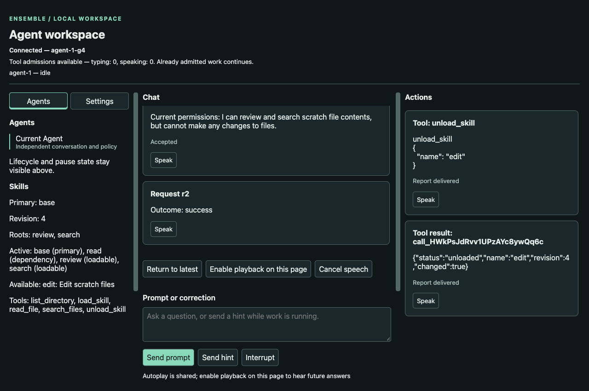
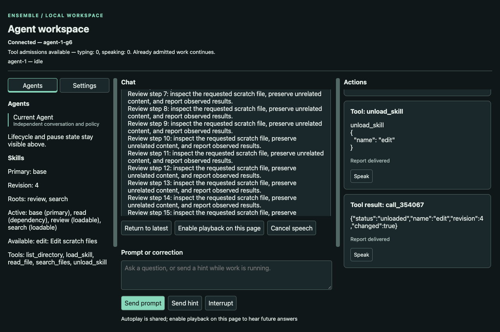

# Chapter 9: Capabilities with an owner

An Agent can remember how to edit a file after its editing tools have been
removed. That is fine. An Agent that can still edit after those tools were
supposedly removed has a different problem.

A skill bundles instructions, tool grants and dependencies. Loading one changes
what the Agent can do next. The useful separation is between the manual the
model has read and the authority the program currently grants it. A convincing
answer about having unloaded a capability changes neither of those facts.

The first edition called the primary skill a constitution and dynamic skills
manuals. Keep that distinction. It also supplied the warning that makes the
storage decision concrete: a loaded manual originally lived inside a tool
result. Later, clearing tool results could discard the instructions while
leaving their tools enabled. Chapter 15 repaired that lifetime mismatch. Here,
a manual gets its own recorded identity from its first load.

The reader should be able to give one Agent an editing capability without
changing its neighbor, its identity or the history of work already done. The
next sections make that small sentence an enforceable contract.

The initial student implementation and actual demonstrations are frozen, with
their failures retained below. The independent live audit accepts the stated
feature evidence; comparative code review and final chapter acceptance remain
separate gates in [the validation record](chapter-09-validation.md).

## TL;DR

Extend `solutions/edition-2/main/` only after the coordinator releases the
accepted Chapter 8 source. Read the architecture ledger and the entire
`book/edition-2/skills/ensemble-coding/SKILL.md` before code. Frozen chapter
exports are references, never worktrees.

1. Add Agent-owned Skills behind common interfaces and a responsible skills
   spoke. Agent owns creation configuration, including primary selection,
   installed-handler ceiling and immutable scalar variables. Skills owns its
   parsed catalog and committed capability/material state. Actor serializes
   candidate acceptance and durable commit; there is no second mutation owner.
2. Freeze a bounded catalog at construction. Support the exact frontmatter,
   identifiers, graph relations and byte limits below. Reject unsupported
   integration fields. Catalog text installs no executable code.
3. The primary and dependency closure initialize atomically. Its rendered body
   becomes the creation-time base system instruction. Skill mode rejects a
   competing nonempty `Config.System`; no-skills mode keeps earlier defaults.
   Deliberate enduring instruction appends remain supplements under existing
   rules. They do not replace the primary and can change the provider prefix.
4. `load_skill` and `unload_skill` prepare a complete candidate and commit it
   through the actor. Explicit roots, shared dependencies, discoverable names
   and effective grants remain distinct. No-op/error changes no revision or
   material. Unload revokes future permission immediately; admitted jobs continue.
5. Declarations and admission use the same committed grants. These management
   tools are paired actor-local control calls without Jobs. They obey pause,
   interruption and literal-next-call limit consumption. Public typed controls
   use the same transition rules without pretending to be model calls.
6. Record every activation's expanded manual separately from its short tool
   acknowledgement. Give it a distinct neutral skill purpose. Project dynamic
   material after the complete call/result batch, at its chronological position.
   Replay reads recorded facts without catalogs, variables or model calls.
7. Expand `$TOOLS`, `$SKILLS` and immutable custom scalar bindings once over the
   candidate. Preserve exact rendered bytes. Unknown/malformed variables fail;
   there is no environment lookup, recursive expansion or custom callback bag.
8. Expose owned public state, `/skills`, safe watch fields and browser skill
   cards. Exercise the shipped full primary and narrow fixture through actual
   CLI, browser and public two-Agent use on all three APIs. Preserve the first
   attempt and teaching review before independent historical comparison.

Build the CLI from main with `go build -o /tmp/ensemble-ch09-cli ./cmd` and the optional GUI from
`main/gui` with `go build -o /tmp/ensemble-ch09-gui ./cmd/ensemble-gui`. The inherited diagnostic is
`make grade-dir CH=10 DIR=solutions/edition-2/main`; its old binary, wire and
fixture assumptions do not cover this contract. The independent Chapter 9
initial command is `python3 scripts/edition2/accept_ch09.py CLI_BINARY`, with
an absolute path to the built CLI. Its 51 checks cover an initial subset.
The combined source-bound command, from the repository root, is
`python3 scripts/edition2/accept_ch09_gate.py SOURCE_COMMIT`;
§9.10's full required matrix, public/browser checks, retained behavior and
actual use remain mandatory. Run it as a black box; do not read the checker or
reviewer internals. The [coverage record](chapter-09-grader-review.md) is for
author/reviewer context, outside the cold student's source set. An accepted
Chapter 8 remains a prerequisite to student release. Public Go method names
remain choices; the bytes, ownership and observable behavior here do not.

## 9.1 Installed, enabled and remembered

Installing a handler makes code available to an application. Granting a tool
makes that handler available to one Agent. Loading a manual gives the model
instructions for using a capability. Treating these as one operation is why a
skill file can accidentally acquire more authority than its author intended.

The installed names selected for an Agent at construction are its ceiling.
A catalog may name only installed handlers when a skill is activated; it cannot
supply Go code or widen that ceiling. Tool schemas still come from Registry.
A Markdown description cannot replace a handler or its schema.

Without skill configuration, preserve the preceding Agent's visible tools and
system defaults. With skills, the effective names are the union of active
skills' grants plus `load_skill` and `unload_skill`. Both management handlers
must be installed in the ceiling. They remain available even when no dynamic
root is active, so the model can recover from unloading its other capabilities.
Ordinary installed tools are not implicitly granted in this mode.

Two skills can grant the same tool. Removing one grant leaves the other intact.
A tool granted by the primary cannot disappear when a dynamic skill unloads.
A model guessing a disabled name gets a paired refusal, even if the handler is
installed and the name still appears in an earlier manual. Declarations help
the model choose; admission decides whether the choice can execute.

This is a capability selection mechanism, not filesystem confinement. Enabling
`run_command` still grants the shell behavior taught earlier. A skill listing
one workspace path does not sandbox that command or make model text a security
boundary.

## 9.2 One owner of the next state

Agent owns its creation configuration: selected primary, catalog source
selection, installed-handler ceiling and copied scalar bindings. Skills reaches
those facts through its Agent parent. It owns the immutable parsed catalog,
active roots and closure, contributors, material activations and derived
renders. Do not keep another mutable copy of Agent configuration inside Skills.
Skill mode, catalog selection, primary, ceiling and scalar bindings are
creation-only. A later general configuration update rejects a change to any
of them before mutating configuration; an unchanged round trip remains valid.

Shared declarations and interfaces belong in core common. Parsing, graph
resolution and substitution belong in the skills spoke; Registry retains
schemas and ordinary tool-argument decoding. Actor lives in llm and reaches
Skills and Registry through Agent. Skills reaches diagnostics through
Skills→Agent→Ensemble. Helpers receive their responsible owner/context too.
No Engine-to-Skills shortcut, sibling service injection or global registration
map repairs a missing parent interface.

Skills prepares an owned candidate from the committed state. It cannot publish
that candidate or update the Registry on its own. Actor orders the operation,
appends its durable transition, then applies that same candidate and publishes
the change. These are steps in one serialized commit path. There is no Skills
worker committing in parallel with the actor and no callback that mutates the
visible tool set afterward. Public state reads and watch snapshots use that
same actor boundary, so none can observe new grants with old material state.

Construction discovers and parses the catalog before exposing the Agent. A
trusted public caller may provide a map of IDs to SKILL.md source bytes;
copy it and use the same parser and byte limits. Dynamic load uses
those frozen definitions. Editing a SKILL.md file affects the next constructed
Agent, not whichever load happens to race with the editor.

A malformed catalog or failed initial closure refuses construction before an
Agent is returned. If the initial durable write fails, construction fails under
the existing log rules; never return an Agent with only some initial grants.
An unsuccessful initialization may leave the existing log infrastructure's
failed artifact for diagnosis, but it is not a usable session.

## 9.3 A deliberately small file format

A selected root contains immediate named directories, each with `SKILL.md`.
Resolve the operator's root once. Reject symlinked child directories and skill
files; require an ordinary readable file. References are identifiers, never
paths. Ignore ordinary files directly in the root; a child directory without
SKILL.md is an error. Do not recursively search arbitrary subdirectories.
These rules constrain catalog discovery, not concurrent hostile filesystem
modification or the authority of already enabled file tools.

Skill IDs match `[a-z][a-z0-9-]{0,63}` and equal their directory names. Tool
names match `[a-z][a-z0-9_]{0,63}`. Publicly supplied catalog keys use the same
identifier rules. The catalog has at most 256 definitions, each source at most
65,536 UTF-8 bytes, and at most 8,388,608 source bytes in total. Source limits
include frontmatter and delimiters. Reject invalid UTF-8, a byte-order mark and
NUL. A file exactly at a limit is valid if its syntax is valid.

The first line is exactly `---`; a later line exactly `---` closes frontmatter.
Accept LF or CRLF line endings, with no bare CR. Delimiter line endings are not
part of the body. Every byte after the closing delimiter's line ending belongs
to the body, including an immediate blank line, later horizontal rules and the
final newline. A closing delimiter at EOF means an empty body. Require a
nonempty body for the primary; other types may have an empty body.

Frontmatter is a restricted YAML-shaped mapping, not a promise to accept every
YAML feature. Keys begin at column zero. Blank lines are allowed; comments,
anchors, aliases, tags, block scalars and nested mappings are rejected. Reject
unknown or repeated keys rather than retaining the last value. The allowed
fields are:

| Field | Value |
|---|---|
| `name` | Required skill ID |
| `description` | Required nonempty single-line string, at most 256 UTF-8 bytes |
| `type` | Required `primary`, `loadable` or `dependency` |
| `tools` | Optional list of tool names; absent means empty |
| `depends` | Optional list of dependency skill IDs; absent means empty |
| `loadable-skills` | Optional list of loadable skill IDs; absent means empty |

For the three single strings, accept an unquoted string, a JSON double-quoted
string, or a single-quoted string with doubled apostrophes. Strip surrounding
ASCII spaces from unquoted values; quoted contents retain their spaces and
must still satisfy the field's grammar. No trailing comment or extra token is
allowed after a quoted value. Unquoted description text starts with a letter
and contains no `#`; other characters, including a colon after the first field
separator, are ordinary text. A numeric description and the case-insensitive reserved words `true`, `false`
and `null` must be quoted to be strings. Decoded newlines and NUL are invalid in every header string.

List values are either a scalar of space-separated identifiers, the exact empty
sequence `[]`, or block items indented by two spaces followed by `- ` and one
identifier. A quoted scalar such as `"read_file write_file"` is also split on
ASCII spaces. Block item identifiers may be quoted by the same rules. Reject
tabs, empty items, duplicate items, commas, flow sequences other than `[]`, mixed
scalar/block forms and any other indentation. Sort semantic sets for use; file
order does not choose dependency order or grant precedence.

This source is a complete valid definition; the body starts at `Use`, without
an extra blank line:

```text
---
name: edit
description: Edit scratch files
type: loadable
tools: write_file edit_file
depends:
  - read
loadable-skills: search
---
Use the editing tools carefully.
Tools:
$TOOLS
Next:
$SKILLS
```

Replacing `tools: write_file edit_file` with two block items produces the same
set. `tools: [write_file, edit_file]`, a second `name`, `depends: ../read`, and
`mcp_servers: local` are errors. A body line `---` remains body text. Unsupported
integration headers fail explicitly: this chapter has no remote-plugin startup,
command hooks or secret configuration hidden inside a parser.

Ship a complete `skills/ensemble/SKILL.md` primary granting the preceding ten
builtins: `read_file`, `write_file`, `edit_file`, `list_directory`, `search_files`,
`run_command`, `wait_for_job`, `send_input`, `kill_job` and `tool_limits`.
Management tools are added by skill mode. Its body describes an ordinary coding
assistant and uses the two built-in variables. Also ship the narrow fixture
used below. The full primary must actually reach the first request and execute
an ordinary task; a special grading fixture is insufficient.

## 9.4 Resolve the whole graph before changing it

There are two edge kinds. `depends` activates a required manual and its grants.
Its target must have type `dependency`. `loadable-skills` advertises a possible
future root; its target must have type `loadable`. Neither relation may target
a primary. A catalog can contain several primaries, but one Agent selects
exactly one. No primary is dynamically loadable or unloadable.

Validate syntax and duplicate identities across the catalog at construction.
Validate references, handler availability and graph cycles when resolving a
candidate's active closure and advertised names. An unreachable definition can
contain a bad dependency or unavailable handler until an attempted activation
makes it relevant. That activation fails atomically. This permits a reader to
see and diagnose a failed load without pretending a partial capability succeeded.

Visit the primary first, then explicit dynamic roots in lexicographic ID order.
For each, visit sorted dependencies before the owner; skip a node already fully
visited. A visiting node reached again is a cycle. A diamond is valid and
activates its shared dependency once. This deterministic postorder supplies
new material order. Tool names and advertised names are separately sorted.

The discoverable set is the union of `loadable-skills` edges from the entire
active closure, minus already active loadable roots. Descriptions come from
the frozen targets. Resolve those advertised IDs and types too, even if their
dependencies have not yet been activated. Hidden catalog entries are not offers.

`load_skill` names one currently discoverable loadable ID. Unknown, undisclosed,
primary and dependency-only names are refused. Loading an already active dynamic
root is an acknowledged no-op even if its original advertiser has since gone.
Other roots remain explicit until unloaded; losing their advertiser does not
silently unload them. Candidate discovery includes newly activated dependencies'
offers as well as the requested skill's offers.

`unload_skill` removes one explicit dynamic root. Unknown names, primary and
dependency-only targets are errors. Unloading a known loadable that is not an
active root is a no-op. Recompute the closure from the remaining roots and
primary. Retire every activation no longer required; keep a shared dependency
and its grants while any root still needs it. Reloading a retired definition
creates a new activation identity, never edits the old one.

For a small fixture, let `base` grant `read_file` and advertise `edit` and
`review`; both depend on `read`, which grants `list_directory`. `edit` grants
`write_file` and advertises `search`; `review` grants no additional tool;
`search` grants `search_files`. Loading edit reveals search and adds the common
read dependency. Loading review adds another reason to retain that dependency.
Unloading edit removes write_file, while review preserves list_directory. If
search was explicitly loaded, it remains active after its advertiser disappears.

A missing dependency, cycle, unavailable grant or failed substitution leaves
all committed roots, grants, offers, material and revision unchanged. Do not
“best effort” the good half of a skill. Diagnostic messages name a safe ID and
static cause without dumping file bodies or configuration.

## 9.5 Render variables over the candidate

A primary that lists its tools should describe the tools it is about to get.
Render bodies after resolving the complete candidate, rather than while a
recursive walk has only found half its dependencies.

Built-in `$TOOLS` is the lexicographically sorted effective names, each prefixed
with `- ` and separated by LF, with no final LF. It includes both management
tools. `$SKILLS` is the sorted currently discoverable IDs, each rendered as
`- ID: DESCRIPTION`, likewise without a final LF. An empty list is the exact
text `(none)`. The lists are descriptive output; they do not authorize calls.

Custom names match `[A-Z][A-Z0-9_]{0,63}` and cannot replace TOOLS or SKILLS.
The public constructor accepts at most 32 copied scalar bindings, each at most
4,096 UTF-8 bytes, with at most 65,536 value bytes in total. Values may be empty
or multiline but must be valid UTF-8 without NUL. Agent owns these immutable
creation values. There are no computed custom callbacks or implicit environment
lookups; an application explicitly decides which ordinary values to supply.
Do not supply secrets merely because the extension accepts strings.

A token is `$NAME` or `${NAME}`, where lexical NAME is an ASCII letter or
underscore followed by letters, digits or underscores. Unbraced tokens consume
the longest name. Only the built-ins and valid supplied custom names resolve.
`$$` emits one literal dollar. Any other unescaped dollar, missing brace or
unknown name is a rendering error. Scan source once; substituted values are
literal and are never rescanned.

For example, bind PROJECT to `demo-$TOOLS`, with effective names load_skill,
read_file and unload_skill and one offer edit. This body:

```text
Project=${PROJECT}; cash=$$5
$TOOLS
$SKILLS
```

renders exactly:

```text
Project=demo-$TOOLS; cash=$5
- load_skill
- read_file
- unload_skill
- edit: Edit scratch files
```

The final LF is present because the source body has one. Each rendered body is
at most 65,536 bytes; all newly rendered bodies in one transition total at most
8,388,608 bytes. Count substituted bytes before publication. A scalar that
expands past the limit fails the entire candidate. Freeze each successful
body's exact bytes and SHA-256 lowercase hex digest in its activation record.
Loading another skill never retroactively rerenders an earlier manual.

The complete encoded skills_initialized or skills_changed record has a separate
64 MiB (67,108,864-byte) limit, including its framing LF when present. Count all
raw bytes: escaping, whitespace, repeated offers, descriptions and retired
summaries. An accepted final record without LF retains the inherited framing
rule and counts its actual bytes. Ordinary-record and header limits are unchanged.
Decoded source/material bounds do not bound this whole fact: a long activation
history can grow its summaries even when no new body is large.

Read incrementally within the raw bound and detect overflow before allocating
beyond that budget; an unbounded ReadBytes followed by a size check is insufficient.
A bounded physical reader may use the larger ceiling before identifying the kind,
then enforce the smaller inherited ordinary/header limit. Serialize and measure
the complete candidate before append or any Skills mutation. Oversize returns
skill_too_large with a safe record-size explanation: no transition event, grant,
material, revision or activation-counter change. It is a controlled refusal,
not a terminal storage-write failure. An enclosing management call still keeps
its ordinary attempted-call/result and limit-consumption facts. Oversize initial
state refuses construction; oversized imported records give a safe line-numbered
error before reduction.

Exact decoded limits remain valid when the complete fact fits. In particular,
retain a positive control for 8 MiB of decoded transition material whose JSON
escaping makes the record substantially larger. Also test exact 67,108,864-byte
raw admission and one-byte-over refusal, without weakening decoded one-over
checks. Check write-side atomic refusal separately from bounded import.

## 9.6 Commit permission without parking the actor

Both management tools require exactly `{"name":"ID"}`. Reject missing, blank,
wrong-type, duplicate and unknown arguments before transition. Their installed
schemas use ordinary function-tool declarations; Tools decodes JSON and hands
Skills a typed operation. Do not teach Skills to parse tool names or wire JSON.

They are actor-local capability controls, with matched `tool_called` and
`tool_returned` under the inherited ordering. They allocate no Job, handle or
`cr/io` file. Each attempted management call consumes pending `tool_limits`,
including an invalid call, no-op or refusal. Tools supplies the inherited
consumption note before the short acknowledgement. These controls accept no
wait/report limit arguments; consuming the settings does not truncate their
acknowledgement or manual and cannot create a process. The next ordinary call
gets defaults unless a later setter supplied new limits.

Pause holds their admission like every other model-issued tool. Interrupt can
refuse a pending management call with the existing paired error; it does not
undo a committed load. Actor must not launch a worker that sends a mutation
back to the actor while the actor is waiting for that worker. Preparation is
bounded in-memory work over the frozen catalog. Durable mutation uses the
existing serialized append path.

Revision is a nonnegative `uint64`: 0 through 18446744073709551615. It begins
at 0 after initialization and increases once per changed transition. Activation
IDs are positive Agent-local `uint64` values allocated in material order;
successful initial activations begin at 1. An unchanged or
failed candidate consumes no activation ID. The primary has an activation too.
Retiring it is forbidden. Each transition records its action, requested name,
new complete state and newly activated material in one durable fact. The
successful append is the commit; apply and publish that fact before returning
success. An append failure leaves the previous committed state and follows the
existing terminal log-failure behavior. If the later tool-result append fails,
the already recorded transition is not rolled back or misreported as uncommitted.

Precheck the next revision and the entire new activation group before mutation
or durable append. Neither counter wraps. If a changed candidate cannot advance
the revision, or its whole activation group cannot fit, refuse with
`skill_too_large`; useful safe detail is `skill revision exhausted` or
`skill activation IDs exhausted`, respectively. Keep roots, material, grants
and counters unchanged. A true no-op at the maximum remains an unchanged
acknowledgement because it allocates nothing. Ordinary call/result facts and
next-attempt limit consumption still follow the rules above.

After an ordinary successful load, the tool's text is exactly this compact
JSON, apart from an optional preceding consumed-limit note:

```json
{"status":"loaded","name":"edit","revision":1,"changed":true}
```

Unload uses `status:"unloaded"`; a no-op uses `status:"unchanged"`,
`changed:false` and the current revision. Errors set the tool result's error
flag and use this shape:

```json
{"error":"skill_unavailable","name":"edit","revision":0}
```

Codes are `invalid_skill_arguments`, `skill_unavailable`, `skill_dependency`,
`skill_tool_unavailable`, `skill_variable` and `skill_too_large`. Invalid
arguments that cannot supply a valid ID use `name:""`. Missing/cyclic/wrong-type
dependency or offer targets use skill_dependency; unknown/hidden or forbidden
root operations use skill_unavailable. Public controls return equivalent typed
facts, with useful safe error detail available to the caller and logger. No-op
and error produce no skill transition event or observation; model attempts
still retain their ordinary call/result facts and limit consumption.

Check the committed grant immediately before each admission. In one accepted
batch, load edit followed by write_file may execute both; unload edit followed
by write_file refuses the second if no contributor remains. A request already
sent retains its original declarations. If a public unload occurs while that
HTTP response is arriving, the returned call is checked against the new state.
Already admitted calls keep their captured permission and finish normally;
revocation is not a second check that kills a worker midway through its effect.

Public typed load/unload are actor controls, available without a model request
or browser. They use the same graph, visibility and commit rules. They do not
consume pending tool limits or count against the model-request policy, since
no model tool call occurred. In no-skills mode they return `skills_disabled`
without mutation. Pause does not block these controls. Active-turn
request limits, hints, interrupt and close keep their Chapter 5/8 semantics.

## 9.7 Keep the manual when the receipt goes away

Skill mode records one `skills_initialized` fact before ordinary conversation
work, using the existing event envelope with payload field `skills`. The payload
has exactly `action:"initialize"`, `name` (the selected primary), sorted
`ceiling` names, complete `state` in the safe shape of §9.8, and `activated`,
the initial activation records. State revision is 0. Later `skills_changed`
events use the same payload field with exactly `action` (`load` or `unload`),
`name`, `state` and `activated`; they cannot replace the ceiling or primary.
An unload's activated array is empty. Every array is present, including empty
ones. The transition's durable event sequence identifies when its material
entered the record.

Each activation has exactly `activation` (positive uint64), `name`, `type`,
`body`, `sha256`, sorted `tools`, sorted `dependencies` (activation IDs), and
`offers` (name/description objects sorted by name). Its dependency IDs point
to active dependency activations, including earlier nodes of this same new
material group. The primary body occurs only in its activation record; the
initial event does not contain a second copy in a message or Config payload.
This also applies to later request captures: in skill mode, retain the existing
request configuration `system` field with the exact empty string, rather than
copying the primary into every request. Rendering and request reconstruction
resolve the base from the recorded immutable primary activation at that prefix.
No-skills request captures retain their previous System bytes and meaning.
A complete activation with no dependencies or offers is:

```json
{"activation":2,"name":"edit","type":"loadable","body":"Use write_file.","sha256":"df71540d67cdaafba180e0f0cd29c9277ec8fd8d791fc2b751a3d80a1e6c1d17","tools":["write_file"],"dependencies":[],"offers":[]}
```

Initial and changed state carry the active IDs and all retired `{name,activation}` summaries.
Retired activations retain their original records rather than receiving new
copies of their bodies. A change adds the newly retired summaries and can
never revive an old activation ID.

Validate shapes, IDs, exact body hashes and the transition from the previous
committed state before public append or replay mutation. A plausible replacement
snapshot is insufficient. Previously recorded activations are immutable: name,
type, body, digest, tools, dependencies and offers cannot change. Fresh IDs use
the next never-used integers in material order, including after an activation
was retired. The `activated` array contains only genuinely new activations;
retained active records keep their IDs and exact facts.

Initialization has revision 0, no explicit dynamic roots or retired activations,
and exactly the selected primary's dependency closure. Each changed record has
the previous revision plus one and obeys the action it names:

- Load adds exactly the requested root, which must be in the previous state's
  discoverable set. Other explicit roots and active activations remain. Add only
  the dependency activations required by that root's closure. An already active
  root is a no-op and must not produce a transition fact.
- Unload removes exactly the requested active root, leaves other explicit roots
  intact and recomputes their closure with the permanent primary. Its activated
  array is empty. Retire exactly the activations no longer in that closure;
  previous retired summaries remain. An inactive target is a no-op and must not
  produce a transition fact.

Require one primary matching initialization, unique active/retired IDs and
active dependency references with consistent names and types. The active set
equals the closure of the primary and explicit roots. State tools equal the
active grant union **plus both mandatory management names**, and every name
lies within the unchanged ceiling. Derive available offers from the active
recorded offers minus active roots. Reject a later initializer, replacement
primary, hidden-root load, unrelated root change, altered retained activation,
reused ID or invalid retirement before any state or history mutation.

Replay checks these invariants from recorded facts without consulting catalogs
or the environment. Live public append additionally prepares the named operation
through the Agent's frozen Skills catalog and creation configuration and requires
the supplied fact to match that candidate. It cannot inject new bodies, offers
or grants merely because their snapshot has a valid shape. Both public append
and typed controls use the same actor commit path and ceiling/visibility checks.

An offline reader can reconstruct a skill log without configuring a live Skills
service. That creates a historical projection, not new runtime authority.
Construction alone may initialize a live skill-enabled Agent; public append
cannot enable skills on a live no-skills Agent or initialize an already exposed
Agent. It refuses such a fact before changing configuration, log or state.
Historical logs without skill facts retain their previous validation rules.

Expose a distinct neutral entry purpose `skill`, with actor `system`, activation
identity and text material. The primary body is the Agent's creation-time
base system instruction, recorded once. Initial dependency manuals are skill
entries before the first dialogue. Dynamic activations contribute one entry
per newly activated non-primary definition, in the deterministic material
order. Empty material still has its identity but adds no provider text.

A transition during an unresolved accepted batch records its fact immediately,
but its material is projected after every call in that batch has a matched
result, in transition order. This includes typed public changes during a held
batch. In skill mode, when an accepted call batch becomes unresolved, give all
then-pending, unanchored hints a stable placement anchor immediately after its
complete results. Give the same anchor to skill entries and unanchored hints
accepted while that batch remains unresolved. Never reassign an existing anchor.
Merge material sharing that anchor by durable event sequence; activations from
one transition keep their defined material order. Derive the anchor from the
accepted batch and receipt events, without a second durable hint record.
Rendering an unresolved prefix still refuses rather than inventing missing
results. A round limit or interruption can end the turn after pairing; the
anchor survives and its material remains available to a later request.

For these skill-mode anchored hints, this chapter supersedes Chapter 5's
placement after a pending ordinary prompt. A hint received after completion
retains that earlier request-tail placement until a later unresolved batch
anchors it. No-skills Agents retain Chapter 5's exact placement behavior. Never globally sort conversation entries or move a retained manual
to the tail. Request captures still list consumed hint sequences in their
original receipt order, independently of where each anchored hint renders.
Consumption removes only the one-request hint text; it does not relocate the
skill entry or its anchor.

For a literal ordering fixture, a held read_file batch has call c1. Hint H at
sequence 10 says `Remember H.`; a typed skill change at 11 activates edit with
body `Use write_file.` and activation 2. The final matched result at 12 is
`done`. The turn then ends before another HTTP request, and the next ordinary
prompt P says `Continue P.`. These selected facts illustrate ordering, not a
complete importable event log. The next provider suffix is results, H, S, P.
Messages has:

```json
{"role":"user","content":[{"type":"tool_result","tool_use_id":"c1","content":"done","is_error":false},{"type":"text","text":"Remember H."},{"type":"text","text":"[skill edit activation 2]\nUse write_file.\n[/skill]"},{"type":"text","text":"Continue P."}]}
```

Chat Completions has these consecutive messages:

```json
[{"role":"tool","tool_call_id":"c1","content":"done"},{"role":"user","content":"Remember H."},{"role":"user","content":"[skill edit activation 2]\nUse write_file.\n[/skill]"},{"role":"user","content":"Continue P."}]
```

generateContent has:

```json
{"role":"user","parts":[{"functionResponse":{"id":"c1","name":"read_file","response":{"result":"done"}}},{"text":"Remember H."},{"text":"[skill edit activation 2]\nUse write_file.\n[/skill]"},{"text":"Continue P."}]}
```

Each excerpt follows the same complete assistant call group; other request
fields are omitted. The ensuing request_sent records `hints:[10]` and consumes
H. At the next projection, remove the entire `Remember H.` text part/message
from these suffixes, leaving results, S, P in that order. Repeated rendering
before consumption is identical. Replay derives the same placement and
consumption without consulting the live catalog.

This is not an enduring-instruction append. Place each nonempty skill entry at
its chronological dialogue position with the exact envelope:

```text
[skill edit activation 2]
Use write_file.
[/skill]
```

Form it as `[skill ID activation N]` plus LF, the exact body bytes, LF and
`[/skill]`. If the body already ends in LF, that deliberately produces an empty
line before the closing marker. Do not trim it. The envelope identifies trusted
catalog instructions without claiming that role text can make an API obey them.

The following literal rendering fixture has primary body `Identity.`, a human
message `Enable editing.`, assistant call `c1` to load_skill with name edit,
result text `{"status":"loaded","name":"edit","revision":1,"changed":true}`,
and activation 2 with body exactly `Use write_file.` (no final LF). Other
required request fields and tool schemas are omitted from these payload excerpts.
Messages produces:

```json
{"system":"Identity.","messages":[{"role":"user","content":[{"type":"text","text":"Enable editing."}]},{"role":"assistant","content":[{"type":"tool_use","id":"c1","name":"load_skill","input":{"name":"edit"}}]},{"role":"user","content":[{"type":"tool_result","tool_use_id":"c1","content":"{\"status\":\"loaded\",\"name\":\"edit\",\"revision\":1,\"changed\":true}","is_error":false},{"type":"text","text":"[skill edit activation 2]\nUse write_file.\n[/skill]"}]}]}
```

Chat Completions produces:

```json
{"messages":[{"role":"system","content":"Identity."},{"role":"user","content":"Enable editing."},{"role":"assistant","tool_calls":[{"id":"c1","type":"function","function":{"name":"load_skill","arguments":"{\"name\":\"edit\"}"}}],"content":""},{"role":"tool","tool_call_id":"c1","content":"{\"status\":\"loaded\",\"name\":\"edit\",\"revision\":1,\"changed\":true}"},{"role":"user","content":"[skill edit activation 2]\nUse write_file.\n[/skill]"}]}
```

generateContent produces:

```json
{"systemInstruction":{"parts":[{"text":"Identity."}]},"contents":[{"role":"user","parts":[{"text":"Enable editing."}]},{"role":"model","parts":[{"functionCall":{"id":"c1","name":"load_skill","args":{"name":"edit"}}}]},{"role":"user","parts":[{"functionResponse":{"id":"c1","name":"load_skill","response":{"result":"{\"status\":\"loaded\",\"name\":\"edit\",\"revision\":1,\"changed\":true}"}}},{"text":"[skill edit activation 2]\nUse write_file.\n[/skill]"}]}]}
```

These are neutral text/call fixtures under the already supported adapter
contracts, not claims about a new provider feature. Actual production signatures
and provenance still follow the earlier same-target rules. Merge adjacent user
blocks where the inherited adapter requires it. A second render is identical
and changes no state, material or usage.

Unloading retires the activation and its grants; its earlier instruction stays
in chronological context in this chapter. Tool-result redaction affects only
the result, never the skill entry. A later explicit retention operation can
remove retired material by identity, but no compactor is implemented here.
Replay validates and reduces recorded transitions without reading catalog files,
expanding variables or executing a load. Historical logs without these events
retain their old meaning. Reconstructing facts is not resuming live jobs or
reopening an Agent with current permissions. Offline skill-log rendering uses
the recorded primary as its base, without adding the CLI's default System or
requiring skill environment variables. A competing explicit nonempty render
System is refused. General live configuration reads retain the established
primary; an unchanged round-trip configuration is allowed, while an attempted
replacement is refused before mutation.

The primary's recorded bytes remain fixed across ordinary loads. Skill mode
rejects a nonempty competing `Config.System` at construction, and later general
configuration cannot replace the base. An omitted/empty system setting retains
it. Explicit enduring instruction appends remain permitted supplements, recorded
and joined under Chapter 2's rules. They can change the overall system prefix;
changing declarations can change requests too. No cache-hit promise follows
from keeping one component stable.

## 9.8 Let every client inspect the same authority

The CLI and GUI command read optional `LLM_SKILLS_DIR` and `LLM_PRIMARY_SKILL`
at construction. Both absent selects no-skills mode. Exactly one present, either
blank when explicitly supplied, or an invalid primary fails with a clear startup
error. Both present select skill mode. Resolve a relative directory against the
launch workspace once; never change process cwd. Do not silently discover a
nearby skill directory or silently select a full primary.

Use the shared configuration reader for both commands. Add the explicit
`LLM_SYSTEM` input, inspecting its presence with LookupEnv; there is no
provider-specific fallback name. In skill mode an absent or explicitly empty
value leaves System unset so the primary supplies the base. A supplied nonempty
value is a startup conflict, even if it happens to equal the primary body; never
silently discard it. A public caller passing a prefilled nonempty default System
must clear it deliberately before selecting skills.

Without skills, pass an explicit LLM_SYSTEM value through the inherited Config
normalization: a nonempty override is used and an absent or empty value retains
the established default. This adds the CLI spelling without changing public
no-skills System semantics. The chapter adds no environment-based custom-variable
lookup. General Config() reads may still expose the effective primary and an
unchanged round trip remains allowed under §9.7; that owned view is distinct
from the empty system field persisted in a skill-mode request capture.

The public library provides an owned skill-state getter and actor-ordered typed
load/unload. The state and Chapter 7 watch snapshot's new `skills` field are
null without skills. Otherwise they have this exact safe shape:

```json
{"revision":1,"primary":"base","roots":["edit"],"active":[{"name":"base","type":"primary","activation":1},{"name":"edit","type":"loadable","activation":2}],"available":[{"name":"search","description":"Search scratch files"}],"tools":["load_skill","read_file","unload_skill","write_file"],"retired":[]}
```

This is a separate two-node shape fixture, not the dependency example of §9.4.
Roots, active, available and tools are lexicographically sorted by name; retired
is sorted by activation and contains `{name,activation}` records. The public
inspection API also exposes contributor IDs and material state as owned values;
it can return recorded material text without accessing files. The browser-safe
snapshot excludes bodies of never-activated skills, custom bindings, full Config,
absolute source paths and credentials. Returned slices/maps cannot mutate the
Agent or another caller's snapshot.

Read current grants and safe state from their committed owner without rebuilding
full historical inspection. State still includes every required retired summary;
copying material bodies and deriving contributors belongs to deliberate inspection.

After a changed commit, publish the next Agent watch revision:

```json
{"kind":"skills_changed","agent_id":"a1","skills":{"revision":1,"primary":"base","roots":["edit"],"active":[{"name":"base","type":"primary","activation":1},{"name":"edit","type":"loadable","activation":2}],"available":[{"name":"search","description":"Search scratch files"}],"tools":["load_skill","read_file","unload_skill","write_file"],"retired":[]}}
```

Watch revision and skill revision are different counters. Capture current skill
state at the existing atomic watch boundary; a reconnect gets it even if the
last transition lies before the 100-event window. Include skills_initialized
and skills_changed among renderable durable events for recent material cards.
A material card uses Agent plus activation identity, displays skill name and
active/retired status, and safely expands the retained text. Put these instruction
cards in the chat pane; ordinary management call/results stay in actions.
Update retirement labels from current state without duplicating a card.

Skill revision and activation values remain exact JSON numeric tokens across
public snapshots, server projection and browser parsing. Extend Chapter 8's
lossless counter handling to these new fields, including active and retired
entries, material events and card identity keys. Never round two activations
into the same card. Safe integers may use ordinary exact parsing; an unsafe
required value needs verified lossless support or visible refusal before the
frame is accepted. Keep arbitrary manual text and tool argument values outside
this protocol-counter conversion.

Add read-only `/skills` to human chat. Show the primary, revision, explicit
roots, active dependencies, discoverable names and effective tool names, or
`Skills disabled.` It makes no model request. Ordinary prompts ask the model
to load/unload through declared tools; the browser submits the same prompts
and shows authoritative skill state in an accessible sidebar section. Add no
browser filesystem selector or credential fields. Existing default CLI protocol
records stay unchanged; callers needing transitions use the public watch.

Manual cards are silent under automatic speech and replay; their explicit
speaker action reads the full retained material. This preserves Chapter 8's
automatic answer/thinking/tool-summary scope. Cards use the same safe renderer,
keyboard expansion, parent ownership and shared native speech service. A skill
body containing HTML is still text on the page. The combined terminal and browser
continue to control one Agent through public interfaces.

## 9.9 Taking it for a spin

Start in a fresh scratch directory with the CLI built above and model credentials
in the inherited environment. Select the shipped catalog by absolute path and
the narrow base primary. An empty LLM_SYSTEM leaves that primary in charge:

```sh
LLM_SKILLS_DIR=/absolute/path/to/main/skills LLM_PRIMARY_SKILL=base LLM_SYSTEM= /tmp/ensemble-ch09-cli chat
```

The student drove this human interface in actual PTYs on October 8, 2026,
observing each answer before continuing. These are student-operated runs, not
sessions Bill personally tested. The frozen [feature matrix and
receipts](../../solutions/edition-2/main/evidence/ch09/live-results.md) cover
normal CLI use, the full primary, browser use and public two-Agent embedding:

| API | Selected model | Generation attempts, including failures |
|---|---|---:|
| Messages | claude-sonnet-4-6 | 32 |
| Chat Completions | gpt-4.1, reported as gpt-4.1-2025-04-14 | 29 |
| generateContent | models/gemini-3.8-flash, resolved/reported as gemini-3.8-flash | 32 |

There were 93 generation attempts and three separate discovery requests. These
are dated identities, not permanent model recommendations. The original Messages
runs used c0e3171; an inherited empty-argument streaming repair produced
75a7255 for later runs. Recovery support at 3da764b used those same repaired
runtime bytes. The initial evidence freeze is 786ff23; the [independent live
review](chapter-09-live-review.md) preserves the complete binding and limits.

Enter `/skills` before a prompt. In all three normal runs it showed revision 0,
base as the only active skill, and load_skill, read_file and unload_skill as the
effective tools. The inspection made no model request. Then ask:

```text
Load edit with load_skill, then use write_file to create notes-created.txt containing exactly CH09-N-WRITE followed by one newline. Do not use a shell. Confirm the actual tool result briefly.
```

Wait for completion and inspect `/skills` again. The actual file held
`CH09-N-WRITE` followed by LF: 13 bytes in total. Revision 1 had read dependency
activation 2 and edit activation 3, and search had become discoverable. Follow with:

```text
Call load_skill for review, then load_skill for search, then unload_skill for edit, in that order. Make the actual calls, do not write files, and summarize the resulting permissions briefly.
```

All three paths reached revision 4: review and search remained explicit roots,
read remained as review's dependency, edit was retired and write_file was absent.
The retained manual still described editing. Its presence did not grant writing.

The next Chat Completions exchange, abridged from the [actual
terminal](../../solutions/edition-2/main/evidence/ch09/live-openai-n/terminal.txt),
made the distinction visible:

```text
You> Now change notes-created.txt to REVOKED-WRITE using write_file, but do not load or reload any skill. If unavailable, say so and leave the file untouched.
[r3 Assistant part 1] The write_file capability is unavailable because the edit skill is not loaded. The file notes-created.txt will remain unchanged.
Request r3 (success; pending hints=0)
```

The file did remain unchanged. Messages also answered with a refusal. Gemini's
captured follow-up omitted write_file from its declarations, but that request
failed in the local relay before an answer arrived. It supplies schema and file
evidence, not a verbal refusal or a forced unauthorized-call test. Deterministic
controls separately force that call and require a paired error with no effect.

Ask for an already active skill and an absent name as actual management calls.
Messages and Chat Completions returned unchanged search and refused absent,
leaving revision 4. Gemini's later bounded management run demonstrated the same
no-op on review and refused absent at revision 1. Its intervening empty-text STOP
omitted required candidatesTokenCount; the parser correctly refused under the
published usage contract. No inferred zero or hidden retry converted it into
an answer. The complete Chat Completions normal session reported input 7,562,
cache write 0, cache read 2,176 and output 253; failed or refused responses are
not evidence of zero provider billing.

For the full primary, start another fresh workspace and put a short marker and
`port=8080` in notes.txt. Select the catalog and primary again; the earlier inline
environment assignments applied only to that command:

```sh
LLM_SKILLS_DIR=/absolute/path/to/main/skills LLM_PRIMARY_SKILL=ensemble LLM_SYSTEM= /tmp/ensemble-ch09-cli chat
```

Ask for tool_limits with ai_callback_delay 0 and max_output_bytes 1, then an
inactive unload_skill edit, read_file notes.txt and a one-line summary.txt.
All three actual runs made that sequence. The management acknowledgement stayed
intact and consumed the limit; the following read returned the full notes.
The first requests contained the full primary and all twelve declarations.

Build the optional GUI from its own module. In another fresh workspace, use the
same narrow skill environment with `/tmp/ensemble-ch09-gui --port 0 --terminal`,
then open the printed URL. Load edit and write a scratch file from the browser;
inspect and unload from the terminal. Both clients address one Agent. Open a
second tab, reconnect it, and compare the current sidebar with the retained
manual card and ordinary management records in Actions.



That screenshot shows the completed terminal-originated turn. The browser driver
had waited for a composer-local status and timed out, even though the outcome
card and terminal showed success. The wrong selector remains in the evidence;
no extra model prompt was sent to repair a test's expectation.

Expand the retained edit card and use its explicit Speak action. Actual click
expansion was observed with all three providers; a separate live Gemini action
focused the card and pressed Enter after retirement:



The screenshot is a viewport into scrollable text. The full receipt retains the
manual through step 20 and literal `<example>` text. The keyboard action's sampled
launch bytes were not saved, so its source, URL, timing and material linkage
cannot establish a byte-exact historical launch comparison. It does establish
the observed Enter expansion, with that disclosed support limitation.

Manual speech submitted the complete 2,455-character retained body on every
provider path. Four original roughly eight-second Chrome-only recordings had quiet
control samples followed by sound energy; the second Messages recording supplied
the longer controlled lead-in. This establishes bounded native output, not a
complete heard manual, intelligibility or model hearing. Ordinary answer/tool
speech continued afterward; skill transitions and reconnect did not
automatically speak the manuals.

For public embedding, build `examples/skills-consumer` in its own module with
`go build -o /tmp/ensemble-ch09-skills-consumer .`. In a fresh working directory,
create alpha/notes.txt and beta/notes.txt with distinct final markers. Choose
either `/tmp/ensemble-ch09-skills-consumer` for typed controls only, or
`/tmp/ensemble-ch09-skills-consumer --ask` to additionally send one bounded
read-and-report turn per Agent using the configured provider. To try both,
use a separate fresh workspace for each: the consumer creates its event logs
exclusively and refuses to reuse them. It supplies its
own catalog and literal PROJECT bindings. Alpha can load edit; beta's narrower
installed ceiling refuses it. Both can read their separate notes.

The Messages beta turn shows why the task outcome must stay beside the authority
checks. The prompt asked for one read and a report, with no other tools. Beta
read its note, also loaded its already active inspect skill, and then unloaded
inspect on its second response. Its two-request allowance was spent. The
consumer exited 1 with `round_limit` and no final beta report. The actual reads,
distinct alpha-$TOOLS/beta-$TOOLS manuals and isolated grants still establish
the public features; they do not finish the requested report.

An embedding example must retain each Agent's partial result, usage and terminal
outcome, finish both independent bounded attempts, then report aggregate failure.
The revised consumer at `06c6787` does this in local subprocess controls: a first
Agent's round-limit failure preserves its partial data and usage, and the second
still completes before aggregate exit 1. No new paid run was made. That reporting
repair leaves the original partial run above unchanged.

Chat Completions completed both reads after a separately bounded recovery from
a relay transport failure. Beta's final answer shortened its marker to beta,
although its captured manual correctly retained beta-$TOOLS. Gemini completed
both reports with the literal markers. These are model outcomes, not changes
to the one-pass variable-expansion rule.

Finally, inspect the recorded history offline. The public redaction demonstration
replaced a load result with `[redacted]` while retaining exactly one unchanged
retired edit manual on every provider projection. Separate OS-denied controls
reconstructed one actual request per provider with catalog reads and networking
unavailable. All 93 attempted request bodies are accounted for by exact replay
evidence: 76 in successful-run verification, 13 in explicitly failed-attempt
verification and four in the independent partial public-run audit. That count
describes request reconstruction, not 93 successful model responses.

The first Messages GUI attempt also remains visible: a complete streamed call
began with input `{}` and supplied an empty argument delta, which the old assembler
incorrectly treated as replacement JSON. Chapter 6's explicit zero-byte fallback
now covers it. The later repaired run elicited that same shape and executed the
empty-object call. The original failure, explicit-path recovery and repaired
demonstration retain their separate identities. Local fault/race/graph controls
and the subsequent comparative review remain necessary alongside these runs.

## 9.10 Checks that protect the boundary

| Contract | Distinguishing positive and negative control |
|---|---|
| Format and limits | Equivalent scalar/block lists; exact source/render/catalog boundaries; body horizontal rules survive; duplicate/unknown/type/path/UTF-8 errors refuse publication |
| Catalog lifetime | Change/delete files after creation; dynamic load still uses frozen bytes; fresh Agent sees the change; symlinked children are refused |
| Graph | Missing dependency, cycle and unavailable grant leave state/revision/material unchanged; diamond activates shared dependency once |
| Discovery | Hidden, primary and dependency-only load refused; newly active offers appear; explicitly loaded child survives advertiser unload |
| Enforcement | Forced disabled call before load/after unload has matched error and no file effect; load/call and unload/call in one batch use current permission |
| Unload | Shared/primary grant survives; no longer required grant disappears; admitted job continues; no-op writes no transition |
| Variables | Candidate lists, unknown/malformed dollar, literal escape, no second expansion, two-Agent scalar isolation and exact expanded-byte limits |
| Material | Primary fixed; new manual at completed batch boundary on all three adapters; result redaction cannot erase it; retired material remains separately identified |
| Commit | Append failure preserves previous authority; later result failure cannot claim rollback; public control during held HTTP affects next admission |
| Counter boundaries | Full uint64 tokens survive snapshots and browser card keys; whole-group exhaustion refuses before mutation; a maximum-revision no-op stays unchanged |
| Replay | Catalog absent and variables unavailable; no filesystem/model calls, identical recorded material/declarations and no usage mutation; altered/reused activation, hidden or unrelated root change and missing management grant are refused |
| Public/browser | Owned-copy mutation, current snapshot independent of card window, safe cards, silent replay, same-Agent CLI/browser and independent-Agent embedding |
| Compatibility | Prior policy capture, settings persistence, jobs, streaming, pause, optional GUI and exact default CLI protocol remain protected |

Counter-exhaustion controls may use an explicitly identified owner-state test
seam or locally constructed state. They must not present a tiny complete log as
valid evidence of exhausting consecutive IDs. Keep public parsing/identity
fixtures separate, and require a passing control plus an intended failure for
whole-group allocation and lifecycle atomicity.

For the critical deletion test, retain declaration filtering but remove admission
authorization. Force write_file before loading edit. The test must fail because
an actual file appeared, even if the model-facing declarations looked perfect.
For instruction lifetime, redact the load result and compare the next complete
request against a passing control: the dedicated manual still appears once,
after the completed result group. For graph atomicity, fail the second branch
of a diamond and assert the entire old state, not merely its tool count.

The inherited grader checks useful pieces of discovery and substitution but
omits unload, complete authorization and these ownership boundaries. Retain its
legacy positive controls while adding the new independent checks. Reviewer
findings must return to the teaching before affected revisions, with the student
confirming whether each clarification resolves the difficulty.

---

The model can keep the manual. The program keeps the decision about whether
its next call may execute. A load changes one Agent's recorded capabilities;
an unload removes grants without rewriting what happened. The browser can now
show the reader both facts instead of asking a reassuring sentence to stand in
for either one.
